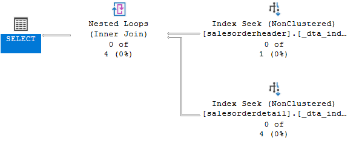
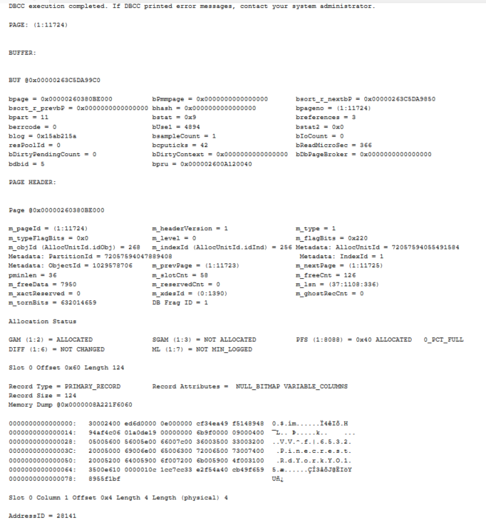

# Indeksy,  optymalizator <br>Lab 4

<!-- <style scoped>
 p,li {
    font-size: 12pt;
  }
</style>  -->

<!-- <style scoped>
 pre {
    font-size: 8pt;
  }
</style>  -->


---

**Imię i nazwisko:** Kacper Sobczyk, Ewa Pelc

--- 

Celem ćwiczenia jest zapoznanie się z planami wykonania zapytań (execution plans), oraz z budową i możliwością wykorzystaniem indeksów.

Swoje odpowiedzi wpisuj w miejsca oznaczone jako:

---
> Wyniki: 

```sql
--  ...
```

---

Ważne/wymagane są komentarze.

Zamieść kod rozwiązania oraz zrzuty ekranu pokazujące wyniki, (dołącz kod rozwiązania w formie tekstowej/źródłowej)

Zwróć uwagę na formatowanie kodu

## Oprogramowanie - co jest potrzebne?

Do wykonania ćwiczenia potrzebne jest następujące oprogramowanie
- MS SQL Server,
- SSMS - SQL Server Management Studio    
- przykładowa baza danych AdventureWorks2017.
    
Oprogramowanie dostępne jest na przygotowanej maszynie wirtualnej


## Przygotowanie  

Uruchom Microsoft SQL Managment Studio.
    
Stwórz swoją bazę danych o nazwie XYZ. 

```sql
create database xyz  
go  
  
use xyz  
go
```

Wykonaj poniższy skrypt, aby przygotować dane:

```sql
select * into [salesorderheader]  
from [adventureworks2017].sales.[salesorderheader]  
go  
  
select * into [salesorderdetail]  
from [adventureworks2017].sales.[salesorderdetail]  
go
```

## Dokumentacja/Literatura

Celem tej części ćwiczenia jest zapoznanie się z planami wykonania zapytań (execution plans) oraz narzędziem do automatycznego generowania indeksów.

Przydatne materiały/dokumentacja. Proszę zapoznać się z dokumentacją:
- [https://docs.microsoft.com/en-us/sql/tools/dta/tutorial-database-engine-tuning-advisor](https://docs.microsoft.com/en-us/sql/tools/dta/tutorial-database-engine-tuning-advisor)
- [https://docs.microsoft.com/en-us/sql/relational-databases/performance/start-and-use-the-database-engine-tuning-advisor](https://docs.microsoft.com/en-us/sql/relational-databases/performance/start-and-use-the-database-engine-tuning-advisor)
- [https://www.simple-talk.com/sql/performance/index-selection-and-the-query-optimizer](https://www.simple-talk.com/sql/performance/index-selection-and-the-query-optimizer)

Ikonki używane w graficznej prezentacji planu zapytania opisane są tutaj:
- [https://docs.microsoft.com/en-us/sql/relational-databases/showplan-logical-and-physical-operators-reference](https://docs.microsoft.com/en-us/sql/relational-databases/showplan-logical-and-physical-operators-reference)


<div style="page-break-after: always;"></div>

# Zadanie 1 - Obserwacja

Wpisz do MSSQL Managment Studio (na razie nie wykonuj tych zapytań):

```sql
-- zapytanie 1  
select *  
from salesorderheader sh  
inner join salesorderdetail sd on sh.salesorderid = sd.salesorderid  
where orderdate = '2008-06-01 00:00:00.000'  
go  
  
-- zapytanie 2  
select orderdate, productid, sum(orderqty) as orderqty, 
       sum(unitpricediscount) as unitpricediscount, sum(linetotal)  
from salesorderheader sh  
inner join salesorderdetail sd on sh.salesorderid = sd.salesorderid  
group by orderdate, productid  
having sum(orderqty) >= 100  
go  
  
-- zapytanie 3  
select salesordernumber, purchaseordernumber, duedate, shipdate  
from salesorderheader sh  
inner join salesorderdetail sd on sh.salesorderid = sd.salesorderid  
where orderdate in ('2008-06-01','2008-06-02', '2008-06-03', '2008-06-04', '2008-06-05')  
go  
  
-- zapytanie 4  
select sh.salesorderid, salesordernumber, purchaseordernumber, duedate, shipdate  
from salesorderheader sh  
inner join salesorderdetail sd on sh.salesorderid = sd.salesorderid  
where carriertrackingnumber in ('ef67-4713-bd', '6c08-4c4c-b8')  
order by sh.salesorderid  
go
```


Włącz dwie opcje: **Include Actual Execution Plan** oraz **Include Live Query Statistics**:


<!-- ![[_img/index1-1.png | 500]] -->


Teraz wykonaj poszczególne zapytania (najlepiej każde analizuj oddzielnie). Co można o nich powiedzieć? Co sprawdzają? Jak można je zoptymalizować?  
(Hint: aby wykonać tylko fragment kodu SQL znajdującego się w edytorze, zaznacz go i naciśnij F5)

---
> Wyniki: 
> 
> Opcja **Actual Execution Plan** w MS SQL Server umożliwia analizę wykonania zapytań SQL, dostarczając szczegółowe informacje o kosztach i czasie poszczególnych operacji po ich wykonaniu. Pozwala to zrozumieć proces przetwarzania zapytań przez bazę danych. Z kolei **Include Live Query Statistics** oferuje możliwość śledzenia wykonania zapytań w czasie rzeczywistym, prezentując aktualne statystyki i koszty operacji. Obydwie funkcje służą do optymalizacji wydajności zapytań.
> 
> **Zapytanie 1:**
> 
> Zapytanie łączy tabelę salesorderheader oraz salesorderdetail (inner join) przy pomocy kolumny salesorderid.
> Ograniczenie jest nakładane na tabelę i chce zwrócić tylko te zamówienia których data jest równa '2008-06-01 00:00:00.000'.
> W tabeli **nie istnieją rekordy z wymaganą datą więc zapytanie nie zwraca żadnego wiersza.**
> 
> System podpowiada, że zastosowanie nonclustered indeksu pozwoliłoby zaoptymalizować zapytanie.
> 
> Execution Plan:
> 
> 
> 
> Live Query:
> 
> 
> 
>
> **Zapytanie 2:**
> 
> To zapytanie SQL łączy tabelę SalesOrderHeader z SalesOrderDetail, by agregować dane o zamówieniach, koncentrując się na sumowaniu ilości zamówień, rabatów i łącznych kwot dla każdego produktu i daty zamówienia. Stosuje filtr HAVING do ograniczenia wyników do produktów zamówionych w ilości przekraczającej 100. W efekcie, zwraca agregowane dane, ujawniając wzorce sprzedaży dla często zamawianych produktów.
> 
> System podpowiada, że zastosowanie nonclustered indeksu pozwoliłoby zaoptymalizować zapytanie.
>
> Execution Plan:
> Zapytanie zczyna się od równoległego skanowania tabel salesorderheader i salesorderdetail. Następnie używa operacji 'hash match' do wykonania wewnętrznego złączenia tych tabel na podstawie wspólnego klucza. Po złączeniu danych, serwer stosuje kolejną operację równoległą, by odpowiednio zorganizować dane dla następnego etapu, którym jest agregacja – sumowanie ilości zamówień, rabatów i łącznych kwot zgodnie z warunkami określonymi w zapytaniu. Po agregacji, z wykorzystaniem filtru, serwer aplikuje warunek 'having', wybierając rekordy spełniające określone kryteria – tutaj sumy ilości zamówień powyżej 100. Na koniec, operacja 'gather streams' integruje równolegle przetworzone dane w ostateczny wynik. 
> 
> 
> 
> Live Query:
>
> 
> 
> 
> **Zapytanie 3:**
> Zapytanie łączy tabelę salesorderheader oraz salesorderdetail (inner join) przy pomocy kolumny salesorderid.
> Ograniczenie jest nakładane na tabelę salesorderheader i chce zwrócić tylko te zamówienia których data jest jedną z tych zawartych w nawiasie.
> W tabeli **nie istnieją rekordy z wymaganą datą więc zapytanie nie zwraca żadnego wiersza.**
> Czas trwania zapytania to 0.113s.
> 
> SSMS sugeruje dodatnie nonclustered indeksu aby przyśpieszyć zapytanie:
> 
> 
> 
> Execution plan:
> W planie można zaobserwować, że po przeskanowaniu tabel łączone są one przy pomocy hash matchu, który polega na wykorzystaniu pierwszego (górnego) wejścia do zbudowania tabeli haszującej, a drugiego (dolnego) wejścia do przeszukiwania (probe) tej tabeli w celu znalezienia dopasowań (lub braku dopasowań) zgodnie z typem łączenia (inner join).
> Dodatkowo można zwrócić uwagę na wysokie koszta (50%) dla skanowania tabeli SD, ale tylko 25% dla tabeli SH. Wynika to z rozmiarów tabel:
> 
> 
> 
> 
> Live query: Podobnie jak w zapytaniu 1 nie mamy żadnych wyników przy wywołaniu
ze względu na ograniczenie dat (przez to Livequery pokazuje zera)
> 
> 
> 
> **Zapytanie 4:**
> Zapytanie łączy tabelę salesorderheader or salesorderdetail (inner join) po kolumnie salesid.
> Zapytanie zwraca salesorderid z tabeli salesorderheader oraz salesordernumer, purchaseordernumber, duedate, shipdate z tabeli salesorderdetail. W tabeli istnieje 68 rekordów, które zgadzają się z warunkiem narzuconym na zapytanie.
> Dodatkowo cały wynik zapytania jest uporządkowany rosnąco po salesorderid. Czas trwania zapytania to 0.147s.
> 
> Tak jak w poprzednich zapytaniach SSMS sugeruje możliwość dodania indeksów nonclustered w celu optymalizacji. 
> To samo dotyczy kosztów skanowania tabeli SD są większe niż w przypadku skanowania tabeli SH, ze względu na większą ilość wierszy w tabeli SD.
> Dodatkowym punktem w Execution Plan jest sortowanie, które odbywa się na samym końcu tuż po pokazaniu wyników zapytania.
> 
> Execution plan:
> 
> 
> 
> Live query:
> 
> 


<div style="page-break-after: always;"></div>

# Zadanie 2 - Optymalizacja

Zaznacz wszystkie zapytania, i uruchom je w **Database Engine Tuning Advisor**:

<!-- ![[_img/index1-12.png | 500]] -->


Sprawdź zakładkę **Tuning Options**, co tam można skonfigurować?

---
> Wyniki:

> 
> To narzędzie pomaga optymalizować wydajność baz danych poprzez analizę zapytań i rekomendowanie zmian w strukturach fizycznych takich jak indeksy i partycjonowanie. Oto główne opcje widoczne na zrzucie ekranu:
> 
>**Limit tuning time**: Pozwala użytkownikowi na ograniczenie czasu, przez który Advisor będzie próbował optymalizować bazę danych. Można to zrobić dla określonego okresu lub do konkretnej daty i godziny.
> 
> **Physical Design Structures (PDS) to use in database**: Pozwala wybrać typy struktur fizycznych, które mają być brane pod uwagę podczas tuningu. Opcje to:
> * Indexes and indexed views: Tuning Advisor rozważy zarówno indeksy, jak i indeksowane widoki.
> * Indexes: Rozważy tylko indeksy. 
> * Indexed views: Skupi się wyłącznie na indeksowanych widokach. 
> * Nonclustered indexes: Zostaną rozważone tylko niezgrupowane indeksy. 
> * Evaluate utilization of existing PDS only: Advisor oceni tylko wykorzystanie istniejących struktur. 
> 
> **Partitioning strategy to employ**: Umożliwia wybór strategii partycjonowania do zastosowania:
>* No partitioning: Nie będą rozważane żadne zmiany w partycjonowaniu. 
>* Aligned partitioning: Partycjonowanie będzie dostosowane do istniejących schematów partycjonowania. 
>
>**Physical Design Structures (PDS) to keep in database**: Decyduje, które z istniejących struktur fizycznych powinny zostać zachowane:
> * Do not keep any existing PDS: Wszystkie istniejące struktury mogą być zmienione lub usunięte. 
> * Keep all existing PDS: Wszystkie istniejące struktury zostaną zachowane. 
> * Keep aligned partitioning: Tylko istniejące struktury zgodne z partycjonowaniem zostaną zachowane. 
> 
> **Advanced Options**: Umożliwia dostęp do bardziej zaawansowanych ustawień, które mogą obejmować opcje takie jak rodzaje zapytań do analizy, rozmiar próbek danych i inne ustawienia tuningu.


---


Użyj **Start Analysis**:

<!-- ![[_img/index1-3.png | 500]] -->


Zaobserwuj wyniki w **Recommendations**.

Przejdź do zakładki **Reports**. Sprawdź poszczególne raporty. Główną uwagę zwróć na koszty i ich poprawę:


<!-- ![[_img/index4-1.png | 500]] -->


Zapisz poszczególne rekomendacje:

Uruchom zapisany skrypt w Management Studio.

Opisz, dlaczego dane indeksy zostały zaproponowane do zapytań:

```sql
CREATE NONCLUSTERED INDEX [_dta_index_salesorderdetail_6_917578307__K1_2_3_4_5_6_7_8_9_10_11] ON [dbo].[salesorderdetail]
(
	[SalesOrderID] ASC
)
INCLUDE([SalesOrderDetailID],[CarrierTrackingNumber],[OrderQty],[ProductID],[SpecialOfferID],[UnitPrice],[UnitPriceDiscount],[LineTotal],[rowguid],[ModifiedDate]) WITH (SORT_IN_TEMPDB = OFF, DROP_EXISTING = OFF, ONLINE = OFF) ON [PRIMARY]
go

CREATE NONCLUSTERED INDEX [_dta_index_salesorderdetail_6_917578307__K1_K5_4_8_9] ON [dbo].[salesorderdetail]
(
	[SalesOrderID] ASC,
	[ProductID] ASC
)
INCLUDE([OrderQty],[UnitPriceDiscount],[LineTotal]) WITH (SORT_IN_TEMPDB = OFF, DROP_EXISTING = OFF, ONLINE = OFF) ON [PRIMARY]
go

SET ANSI_PADDING ON

go

CREATE NONCLUSTERED INDEX [_dta_index_salesorderdetail_6_917578307__K3_1] ON [dbo].[salesorderdetail]
(
	[CarrierTrackingNumber] ASC
)
INCLUDE([SalesOrderID]) WITH (SORT_IN_TEMPDB = OFF, DROP_EXISTING = OFF, ONLINE = OFF) ON [PRIMARY]
go

CREATE STATISTICS [_dta_stat_917578307_1_3] ON [dbo].[salesorderdetail]([SalesOrderID], [CarrierTrackingNumber])
WITH AUTO_DROP = OFF
go

CREATE NONCLUSTERED INDEX [_dta_index_salesorderheader_6_901578250__K3_K1_2_4_5_6_7_8_9_10_11_12_13_14_15_16_17_18_19_20_21_22_23_24_25_26] ON [dbo].[salesorderheader]
(
	[OrderDate] ASC,
	[SalesOrderID] ASC
)
INCLUDE([RevisionNumber],[DueDate],[ShipDate],[Status],[OnlineOrderFlag],[SalesOrderNumber],[PurchaseOrderNumber],[AccountNumber],[CustomerID],[SalesPersonID],[TerritoryID],[BillToAddressID],[ShipToAddressID],[ShipMethodID],[CreditCardID],[CreditCardApprovalCode],[CurrencyRateID],[SubTotal],[TaxAmt],[Freight],[TotalDue],[Comment],[rowguid],[ModifiedDate]) WITH (SORT_IN_TEMPDB = OFF, DROP_EXISTING = OFF, ONLINE = OFF) ON [PRIMARY]
go

CREATE NONCLUSTERED INDEX [_dta_index_salesorderheader_6_901578250__K1_4_5_8_9] ON [dbo].[salesorderheader]
(
	[SalesOrderID] ASC
)
INCLUDE([DueDate],[ShipDate],[SalesOrderNumber],[PurchaseOrderNumber]) WITH (SORT_IN_TEMPDB = OFF, DROP_EXISTING = OFF, ONLINE = OFF) ON [PRIMARY]
go

CREATE NONCLUSTERED INDEX [_dta_index_salesorderheader_6_901578250__K3_1] ON [dbo].[salesorderheader]
(
	[OrderDate] ASC
)
INCLUDE([SalesOrderID]) WITH (SORT_IN_TEMPDB = OFF, DROP_EXISTING = OFF, ONLINE = OFF) ON [PRIMARY]
go

CREATE STATISTICS [_dta_stat_901578250_1_3] ON [dbo].[salesorderheader]([SalesOrderID], [OrderDate])
WITH AUTO_DROP = OFF
go
```

---


Sprawdź jak zmieniły się Execution Plany. Opisz zmiany:

---
> Wyniki: 
> 
> **Zapytanie 1**:
> 
> 
> 
> **Zapytanie 2**:
> 
> 
> 
> **Zapytanie 3**:
> 
>
> 
> **Zapytanie 4**:
> 
> 
> Komentarz:
> 
> Analizując plany wykonania zapytań przed i po optymalizacji, widoczne jest znaczące 
> skrócenie czasu kompilacji. Jako przykład, czas przewidziany dla wykonania zapytania numer 4 zmalał z 0,147 sekundy do zaledwie 0,09 sekundy po wprowadzeniu optymalizacji. Mimo że w kontekście niewielkich tabel lub prostych zapytań, tak drobna różnica czasowa może wydawać się nieistotna, sugeruje to, jak wielką rolę może odegrać proponowane indeksowanie w przypadku obsługi większych zbiorów danych. 
> Należy jednak pamiętać o dodatkowym obciążeniu pamięciowym, które niesie za sobą indeksowanie, co wymaga umiejętnego balansowania procesu optymalizacji.
> Istotną zmianą jest także zastąpienie operacji "Table Scan" przez "Index Seek" na wstępnym etapie przetwarzania zapytania. "Index Seek" pozwala na efektywne odnalezienie szukanych wierszy przez wykorzystanie indeksu, co jest o wiele szybsze niż przeszukiwanie całej tabeli, jak ma to miejsce w "Table Scan". Operacja ta koncentruje się na przeszukaniu tylko określonej kolumny na podstawie indeksu.
> Dodatkowo, w niektórych miejscach, gdzie wcześniej używano "Hash Match", teraz zastosowano "Nested Loops". Technika ta polega na zagnieżdżeniu pętli, co umożliwia dla każdego rekordu z jednej tabeli znalezienie odpowiadającego mu rekordu w drugiej tabeli, co teraz, dzięki indeksowaniu, przebiega znacznie szybciej niż w przypadku użycia "Hash Match".

---


<div style="page-break-after: always;"></div>

# Zadanie 3 - Kontrola "zdrowia" indeksu

## Dokumentacja/Literatura

Celem kolejnego zadania jest zapoznanie się z możliwością administracji i kontroli indeksów.

Na temat wewnętrznej struktury indeksów można przeczytać tutaj:
- [https://technet.microsoft.com/en-us/library/2007.03.sqlindex.aspx](https://technet.microsoft.com/en-us/library/2007.03.sqlindex.aspx)
- [https://docs.microsoft.com/en-us/sql/relational-databases/system-dynamic-management-views/sys-dm-db-index-physical-stats-transact-sql](https://docs.microsoft.com/en-us/sql/relational-databases/system-dynamic-management-views/sys-dm-db-index-physical-stats-transact-sql)
- [https://docs.microsoft.com/en-us/sql/relational-databases/system-dynamic-management-views/sys-dm-db-index-physical-stats-transact-sql](https://docs.microsoft.com/en-us/sql/relational-databases/system-dynamic-management-views/sys-dm-db-index-physical-stats-transact-sql)
- [https://docs.microsoft.com/en-us/sql/relational-databases/system-catalog-views/sys-indexes-transact-sql](https://docs.microsoft.com/en-us/sql/relational-databases/system-catalog-views/sys-indexes-transact-sql)

Sprawdź jakie informacje można wyczytać ze statystyk indeksu:

```sql
select *  
from sys.dm_db_index_physical_stats (db_id('adventureworks2017')  
,object_id('humanresources.employee')  
,null -- null to view all indexes; otherwise, input index number  
,null -- null to view all partitions of an index  
,'detailed') -- we want all information
```

Jakie są według Ciebie najważniejsze pola?

---
> Najważniejsze pola (imo): 
>
> **avg_fragmentation_in_percent**: procentowa wartość fragmentacji indeksu, która wskazuje, jak bardzo indeks jest logicznie fragmentowany.
> 
> **fragment_count**: liczba fragmentów, na które podzielony jest indeks. Pokazuje, ile osobnych miejsc na dysku musi odwiedzić SQL Server, aby zebrać dane.
>
> **page_count**: całkowita liczba stron indeksu lub danych w użyciu, co daje wgląd w rozmiar indeksu.
> 
> **avg_page_space_used_in_percent**: wskazuje, jaki procent przestrzeni dyskowej przydzielonej na przechowywanie indeksu faktycznie zawiera dane. Jest to ważne dla oceny efektywności użycia przestrzeni dyskowej.
> 
> **index_depth**: głębokość drzewa. Wysoka wartość tego pola może sugerować, że indeksy są bardziej skomplikowane i mogą być kosztowne w zakresie wykorzystania zasobów systemu.
> 
> **index_type**: wskazuje ona typ indeksu analizowanego w ramach statystyk. Typ indeksu może mieć znaczący wpływ na sposób wykorzystania i optymalizacji indeksów w bazie danych.

---


Sprawdź, które indeksy w bazie danych wymagają reorganizacji:

```sql
use adventureworks2017  
  
select object_name([object_id]) as 'table name',  
index_id as 'index id'  
from sys.dm_db_index_physical_stats (db_id('adventureworks2017')  
,null -- null to view all tables  
,null -- null to view all indexes; otherwise, input index number  
,null -- null to view all partitions of an index  
,'detailed') --we want all information  
where ((avg_fragmentation_in_percent > 10  
and avg_fragmentation_in_percent < 15) -- logical fragmentation  
or (avg_page_space_used_in_percent < 75  
and avg_page_space_used_in_percent > 60)) --page density  
and page_count > 8 -- we do not want indexes less than 1 extent in size  
and index_id not in (0) --only clustered and nonclustered indexes
```


---
> Wyniki: 
> zrzut ekranu/komentarz:
> 
> 
> 
>
> 
> 
> 
> Reorganizacja indeksu to proces optymalizacji indeksów w bazie danych, który ma na celu zmniejszenie ich fragmentacji. Gdy dane są dodawane, aktualizowane lub usuwane, struktury indeksów mogą stać się nieefektywne – fragmentacja indeksów polega na rozproszeniu danych indeksu na dysku, co zwiększa czas potrzebny na odczyt tych danych podczas wykonywania zapytań.
> Reorganizacja indeksu jest mniej kosztowna w zakresie wykorzystania
zasobów niż przebudowa indeksu, ale może nie zapewnić tak dużego zwiększenia
wydajności jak przebudowa.
> 
> Reorganizacja indeksu ustawia ponownie strony indeksu w kolejności zgodnej z kluczem indeksu, co przyczynia się do poprawy wydajności zapytań, ponieważ dane są fizycznie ułożone w sposób bardziej sekwencyjny, co ułatwia ich szybkie odnalezienie.
> 
> 
>


---


Sprawdź, które indeksy w bazie danych wymagają przebudowy:

```sql
use adventureworks2017  
  
select object_name([object_id]) as 'table name',  
index_id as 'index id'  
from sys.dm_db_index_physical_stats (db_id('adventureworks2017')  
,null -- null to view all tables  
,null -- null to view all indexes; otherwise, input index number  
,null -- null to view all partitions of an index  
,'detailed') --we want all information  
where ((avg_fragmentation_in_percent > 15) -- logical fragmentation  
or (avg_page_space_used_in_percent < 60)) --page density  
and page_count > 8 -- we do not want indexes less than 1 extent in size  
and index_id not in (0) --only clustered and nonclustered indexes
```

---
> Wyniki: 
> zrzut ekranu/komentarz:
> 
> 
> 
> 
> 
> 
> 
> Przebudowa indeksu to proces, w którym indeks jest całkowicie odbudowywany. Jest to bardziej intensywny proces niż reorganizacja i jest zazwyczaj wykonywany, kiedy indeks jest bardzo fragmentaryczny. Przebudowa indeksu usuwa całą fragmentację, ponownie sortując dane indeksu i zapisując indeks od nowa na dysku, co może również skutkować zwolnieniem przestrzeni dyskowej, jeśli w indeksie były duże luki.
> 

---

Czym się różni przebudowa indeksu od reorganizacji?

(Podpowiedź: [http://blog.plik.pl/2014/12/defragmentacja-indeksow-ms-sql.html](http://blog.plik.pl/2014/12/defragmentacja-indeksow-ms-sql.html))

---
> Przebudowa indeksu to pełne odtworzenie indeksu, które usuwa całą fragmentację i często wymaga czasowej wyłączności tabeli. Reorganizacja indeksu to lżejsza operacja, która zmniejsza fragmentację przez uporządkowanie stron indeksu i jest zwykle wykonywana bez blokowania tabeli. Przebudowa jest preferowana dla silnie fragmentowanych indeksów, reorganizacja dla mniej fragmentowanych. Wybór metody zależy od fragmentacji i wymagań dotyczących dostępności tabel.


---

Sprawdź co przechowuje tabela sys.dm_db_index_usage_stats:

---
> Wyniki: 
>
>
> Sys.dm_db_index_usage_stats to tabela systemowa, która gromadzi dane dotyczące częstotliwości użycia poszczególnych indeksów w aktywnej instancji bazy danych. Informuje o liczbie wykorzystań indeksu w różnych operacjach oraz o czasie ostatniej aktywności na indeksie.
>Opis kolumn:
> * database_id: identyfikator bazy danych, gdzie znajduje się indeks, 
> * object_id: identyfikator tabeli lub widoku, z którym związany jest indeks, 
> * index_id: numer identyfikacyjny indeksu, 
> * user_seeks: ile razy indeks był wykorzystany do szybkiego odnalezienia danych, 
> * user_scans: ile razy przeszukano indeks w poszukiwaniu danych, 
> * user_lookups: ile razy indeks był wykorzystywany do pobierania wierszy przez zakładki, 
> * user_updates: ile razy indeks był aktualizowany przez zapytania użytkowników, 
> * last_user_seek: data i czas ostatniego użycia indeksu do wyszukiwania, 
> * last_user_scan: data i czas ostatniego pełnego skanowania indeksu,
> * etc.


---


Napraw wykryte błędy z indeksami ze wcześniejszych zapytań. Możesz użyć do tego przykładowego skryptu:

```sql
use adventureworks2017  
  
--table to hold results  
declare @tablevar table(lngid int identity(1,1), objectid int,  
index_id int)  
  
insert into @tablevar (objectid, index_id)  
select [object_id],index_id  
from sys.dm_db_index_physical_stats (db_id('adventureworks2017')  
,null -- null to view all tables  
,null -- null to view all indexes; otherwise, input index number  
,null -- null to view all partitions of an index  
,'detailed') --we want all information  
where ((avg_fragmentation_in_percent > 15) -- logical fragmentation  
or (avg_page_space_used_in_percent < 60)) --page density  
and page_count > 8 -- we do not want indexes less than 1 extent in size  
and index_id not in (0) --only clustered and nonclustered indexes  
  
select 'alter index ' + ind.[name] + ' on ' + sc.[name] + '.'  
+ object_name(objectid) + ' rebuild'  
from @tablevar tv  
inner join sys.indexes ind  
on tv.objectid = ind.[object_id]  
and tv.index_id = ind.index_id  
inner join sys.objects ob  
on tv.objectid = ob.[object_id]  
inner join sys.schemas sc  
on sc.schema_id = ob.schema_id
```


Napisz przygotowane komendy SQL do naprawy indeksów:

---
> Wyniki:
>```sql
>alter index XMLPATH_Person_Demographics on Person.Person rebuild
>alter index XMLPROPERTY_Person_Demographics on Person.Person rebuild
>alter index XMLVALUE_Person_Demographics on Person.Person rebuild
>```

---

<div style="page-break-after: always;"></div>

# Zadanie 4 - Budowa strony indeksu

## Dokumentacja

Celem kolejnego zadania jest zapoznanie się z fizyczną budową strony indeksu 
- [https://www.mssqltips.com/sqlservertip/1578/using-dbcc-page-to-examine-sql-server-table-and-index-data/](https://www.mssqltips.com/sqlservertip/1578/using-dbcc-page-to-examine-sql-server-table-and-index-data/)
- [https://www.mssqltips.com/sqlservertip/2082/understanding-and-examining-the-uniquifier-in-sql-server/](https://www.mssqltips.com/sqlservertip/2082/understanding-and-examining-the-uniquifier-in-sql-server/)
- [http://www.sqlskills.com/blogs/paul/inside-the-storage-engine-using-dbcc-page-and-dbcc-ind-to-find-out-if-page-splits-ever-roll-back/](http://www.sqlskills.com/blogs/paul/inside-the-storage-engine-using-dbcc-page-and-dbcc-ind-to-find-out-if-page-splits-ever-roll-back/)

Wypisz wszystkie strony które są zaalokowane dla indeksu w tabeli. Użyj do tego komendy np.:

```sql
dbcc ind ('adventureworks2017', 'person.address', 1)  
-- '1' oznacza nr indeksu
```

Zapisz sobie kilka różnych typów stron, dla różnych indeksów:

---
indeks 1


indeks 2


indeks 3


indeks 4


**Komentarz:**
Jedną z kolumn wynikowych zapytania jest "PageType", która reprezentuje typ strony. Na podstawie tej kolumny jesteśmy w stanie odczytać typ strony dla każdej strony indeksu, która została zwrócona przez polecenie `DBCC IND`. Zgodnie ze źródłem: *Type = 1 to strona danych, Type = 2 to strona indeksu, a Type = 10 to strona IAM, która utrzymuje sam indeks.*


---

Włącz flagę 3604 zanim zaczniesz przeglądać strony:

```sql
dbcc traceon (3604);
```

**Komentarz:**

Polecenie DBCC TRACEON (3604); włącza wyjście komunikatów debugowania dla niektórych poleceń DBCC, np. `DBCC IND`. Są one wyświetlane w zakładce Messages. Jest to przydatne podczas diagnozowania problemów związanych z bazą danych (nie trzeba analizować logów systemowych).

Zawartość zakładki Messages bez włączania flagi:
> 


z włączoną flagą:

> 

---

Sprawdź poszczególne strony komendą DBCC PAGE. np.:

```sql
dbcc page('adventureworks2017', 1, 13720, 3);
```

**Komentarz:**

W powyższym poleceniu:
- 1 oznacza numer pliku danych, który zawiera strony, do których chcę uzyskać dostęp
- 13720 jest to numer identyfikacyjny strony, którą chcę analizować
- 3 jest to rodzaj informacji, którą chcę uzyskać. 3 oznacza pełne zakodowanie zawartości strony.
---

Plik 1, strona 11724, pagetype = 1 (strona danych), indeks 1 :



Plik 1, strona 5888, pagetype = 2 (strona indeksu), indeks 2 :


Plik 1, strona 2164, pagetype = 10 (strona IAM, która przetrzymuje indeks), indeks 4 :


Zapisz obserwacje ze stron. Co ciekawego udało się zaobserwować?

**Komentarz:**

Obserwację i analizę wykonano są dla 3 typów stron (PageType):

Typ 1 - strona danych:
- Struktura strony: Strona danych zawiera sekcje przeznaczone na przechowywanie rzeczywistych rekordów tabeli w formie wierszy, wraz z metadanymi takimi jak identyfikatory wierszy, wartości kolumn, wskaźniki do innych stron danych itp.
- Nagłówek strony danych zawiera informacje o strukturze strony, takie jak numer strony, typ strony, informacje o alokacji itp.

Typ 2 - strona indeksu:
- Struktura strony: strona indeksu zaweira klucze indeksu, które są przechowywane w porządku zgodnym z kolejnością sortowania określoną przez indeks. Klucze indeksu umożliwiają szybkie wyszukiwanie i sortowanie danych. AddressID jest to ID wiersza z daną wartością indeksu. KeyHashValue jest wartością funkcji skrótu dla klucza - może przyspieszyć operacje wyszukiwania w indeksie.

Typ 10 - IAM:
- Struktura strony: zawiera informacje o alokacji i używaniu stron w pliku danych - czyli które strony w pliku danych są zaalokowane i używane przez konkretne obiekty w bazie danych, takie jak tabele, indeksy itp.


---

Punktacja:

|   |   |
|---|---|
|zadanie|pkt|
|1|3|
|2|3|
|3|3|
|4|1|
|razem|10|