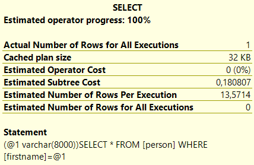
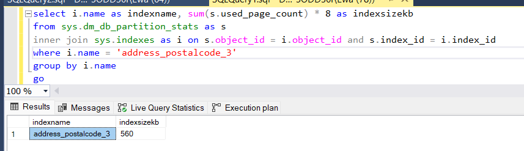

# Indeksy,  optymalizator <br>Lab 5

<!-- <style scoped>
 p,li {
    font-size: 12pt;
  }
</style>  -->

<!-- <style scoped>
 pre {
    font-size: 8pt;
  }
</style>  -->


---

**Imię i nazwisko:** Ewa Pelc, Kacper Sobczyk

--- 

Celem ćwiczenia jest zapoznanie się z planami wykonania zapytań (execution plans), oraz z budową i możliwością wykorzystaniem indeksów (cz. 2.)

Swoje odpowiedzi wpisuj w miejsca oznaczone jako:

---
> Wyniki: 

```sql
--  ...
```

---

Ważne/wymagane są komentarze.

Zamieść kod rozwiązania oraz zrzuty ekranu pokazujące wyniki, (dołącz kod rozwiązania w formie tekstowej/źródłowej)

Zwróć uwagę na formatowanie kodu

## Oprogramowanie - co jest potrzebne?

Do wykonania ćwiczenia potrzebne jest następujące oprogramowanie
- MS SQL Server,
- SSMS - SQL Server Management Studio    
- przykładowa baza danych AdventureWorks2017.
    
Oprogramowanie dostępne jest na przygotowanej maszynie wirtualnej


## Przygotowanie  

Uruchom Microsoft SQL Managment Studio.
    
Stwórz swoją bazę danych o nazwie XYZ. 

```sql
create database lab5  
go  
  
use lab5  
go
```


## Dokumentacja/Literatura

Obowiązkowo:

- [https://docs.microsoft.com/en-us/sql/relational-databases/indexes/indexes](https://docs.microsoft.com/en-us/sql/relational-databases/indexes/indexes)
- [https://docs.microsoft.com/en-us/sql/relational-databases/sql-server-index-design-guide](https://docs.microsoft.com/en-us/sql/relational-databases/sql-server-index-design-guide)
- [https://www.simple-talk.com/sql/performance/14-sql-server-indexing-questions-you-were-too-shy-to-ask/](https://www.simple-talk.com/sql/performance/14-sql-server-indexing-questions-you-were-too-shy-to-ask/)

Materiały rozszerzające:
- [https://www.sqlshack.com/sql-server-query-execution-plans-examples-select-statement/](https://www.sqlshack.com/sql-server-query-execution-plans-examples-select-statement/)

<div style="page-break-after: always;"></div>

# Zadanie 1 - Indeksy klastrowane I nieklastrowane

Skopiuj tabelę `Customer` do swojej bazy danych:

```sql
select * into customer from adventureworks2017.sales.customer
```

Wykonaj analizy zapytań:

```sql
select * from customer where storeid = 594  
  
select * from customer where storeid between 594 and 610
```

Zanotuj czas zapytania oraz jego koszt koszt:

---
> Wyniki:
>
>
>
>Koszt pierwszego zapytania:
>
>
>
>Koszt drugiego zapytania:
>
>
>
>**Komentarz:**
>
> W obu przypadkach koszty zapytania są takie same. Zapewne ma to związek z wykonaną operacją table scan. 
> W obu przypadkach zapytanie odczytało wszystkie 19820 rekordów znajdujących się w tabeli. Pozyskanie tych, które pasują do klauzuli where nie wiąże się z dodatkowym kosztem ze względu na ilośc rekordów.


Dodaj indeks:

```sql
create  index customer_store_cls_idx on customer(storeid)
```

Jak zmienił się plan i czas? Czy jest możliwość optymalizacji?


Koszt pierwszego:


Koszt drugiego:


---
> Wyniki: 

**Komentarz:**
Po dodaniu klastra zmienił się plan wykonania zapytania.
Table Scan został zastąpiony bardziej optymalnym blokiem Index Scan, który przeszukuje indeks w poszukiwaniu konkretnych wartości, które są wymagane w zapytaniu. Ta operacja szybko ograniczy liczbę wierszy, które będą rozpatrywane dalej.

Następnie jest blok RID Lookup, aby znaleźć pozostałe kolumny (Index Scan wyszukuje tylko wartości z kolumny indeksu, a potem muszą zostać do tego "dołożone" wartości z pozostałych kolumn).

Następnie występuje blok Nested Loops (Inner Join). Blok ten występuje wspólnie z blokiem RID Lookup do znalezienia pozostałych wartości wierszy i kolumn.

**Ważne:** Koszt Index Scan to zaledwie około 0.0001, dla porównania koszt Table Scan to 0.02

Dodaj indeks klastrowany:

```sql
create clustered index customer_store_cls_idx on customer(storeid)
```

Czy zmienił się plan i czas? Skomentuj dwa podejścia w wyszukiwaniu krotek.


---
> Wyniki: 


Koszt pierwszego:


Koszt drugiego:


**Komentarz:**

Tak jak poprzednio czasy przy tak małej ilości rekordów w tabeli zawierają się w milisekundach. Jednak patrząc na koszt to można zauważyć, że zmniejszył się on dwukrotnie w porównaniu do poprzedniego indeksu.

W planie wykonania zapytania pojawił się blok Clustered Index Seek, który wyszukuje odpowiedni wiersz w indeksie. Indeks klastrowany zorganizował fizyczną koljeność danych na dysku zgodnie z kluczem głównym tabeli.  Organizacja danych opiera się na strukturze B-drzewa, które jest bardzo wydajne w wyszukiwaniu wartości. W przypadku B-drzewa nie wszystkie wiersze muszą zostać przeskanowane tak jak w przypadku Table Scan. Dodatkowo, dzięki temu że dane są posortowane wg klucza głównego, nie ma konieczności sortowani całej tabeli.

Koszt wykonania obu zapytań to około 0.003, jest to więcej niż w przypadku zwykłego indeksu, ale mniej niż bez zastosowania żadnych indeksów.


# Zadanie 2 – Indeksy zawierające dodatkowe atrybuty (dane z kolumn)

Celem zadania jest poznanie indeksów z przechowujących dodatkowe atrybuty (dane z kolumn)

Skopiuj tabelę `Person` do swojej bazy danych:

```sql
select businessentityid  
      ,persontype  
      ,namestyle  
      ,title  
      ,firstname  
      ,middlename  
      ,lastname  
      ,suffix  
      ,emailpromotion  
      ,rowguid  
      ,modifieddate  
into person  
from adventureworks2017.person.person
```
---

Wykonaj analizę planu dla trzech zapytań:

```sql
select * from [person] where lastname = 'Agbonile'  
  
select * from [person] where lastname = 'Agbonile' and firstname = 'Osarumwense'  
  
select * from [person] where firstname = 'Osarumwense'
```


Co można o nich powiedzieć?

---
> Wyniki: 
> 
> Każde z trzech zapytań zwraca jeden rekord w bazie danych i jest nim ta sama osoba.
> 
> 
> Czasy wykonywania zapytań ją niemal identyczne jednak różnią sie:
> * Zapytanie 1 pokazuje, że został wykonany pełen skan tabeli (Table Scan) i że jedna z dwóch możliwych ścieżek została wybrana do wykonania zapytania. Jest to 50% całej tabeli, co może oznaczać, że zapytanie zostało zoptymalizowane pod kątem wybranego warunku. 
> * Zapytanie 2 również pokazuje pełen skan tabeli, ale w tym przypadku użyto jednej ścieżki na jedną możliwą, co wskazuje na 100% efektywność w kontekście dostępnych opcji. Oznacza to, że filtr na 'lastname' i 'firstname' skutecznie zawęził wyniki do jednego rekordu bez potrzeby przeglądania większej liczby rekordów. 
> * Zapytanie 3 także przedstawia pełny skan tabeli, ale w tym przypadku skanuje on tylko 7% tabeli, co sugeruje, że tabeli person jest większa, a zapytanie było w stanie znaleźć odpowiedni rekord szybciej, być może ze względu na lepsze warunki wyszukiwania lub organizację danych.


Koszt pierwszego:


Koszt drugiego:


Koszt trzeciego:




**Komentarz:**

W planie wykonania zapytania występuje tylko operacja Table Scan, która skanuje całą tabelę.
Koszty wykonania są takie same dla wszystkich zapytań i wynoszą około 0.18


Przygotuj indeks obejmujący te zapytania:

```sql
create index person_first_last_name_idx  
on person(lastname, firstname)
```

Sprawdź plan zapytania. Co się zmieniło?

---
> Wyniki: 


Koszt pierwszego:


Koszt drugiego:


Koszt trzeciego:


**Komentarz:**

Tak jak w poprzednim zadaniu, bloki Table Scan po zastosowaniu indeksu zostały zastąpione Index Seek, RID Lookup oraz Nested Loops (Inner Join). Index Seek przeszukuje index, aby zawęzić ilość rozpatrywanych wierszy zgodnie z warunkiem. Następnie RID Lookup oraz Nested Loops wspólnie służą temu, aby znaleźć pozostałe kolumny, o których mowa w zapytaniu. 

Istnieje tylko jeden rekord z tabeli Person, o imieniu 'Osarumwense' lub nazwisku 'Agbonile', a jednak koszty wykonania różnią się dla zapytania pierwszego i trzeciego (0.008 vs 0.15).  

---

Przeprowadź ponownie analizę zapytań tym razem dla parametrów: `FirstName = ‘Angela’` `LastName = ‘Price’`. (Trzy zapytania, różna kombinacja parametrów). 

Czym różni się ten plan od zapytania o `'Osarumwense Agbonile'` . Dlaczego tak jest?


---
> Wyniki: 


Koszt pierwszego:


Koszt drugiego:


Koszt trzeciego:


Ilość wierszy spełniających warunek:


**Komentarz:**

Dla nazwiska 'Price' i imienia 'Angela', tylko zapytanie 2 posiadające warunek imienia i nazwiska jest wykonywane w optymalny sposób. Dla zapytania z warunkiem tylko dla imienia albo nazwiska występuje operacja Table Scan skanująca wszystkie wiersze.

Dlaczego?
- Warto zauważyć, że rekordów z wartością kolumny firstname = 'Angela' lub wartością kolumny lastname = 'Price' jest po kilkadziesiąt. Dane te mogą być rozproszone na wielu stronach.
- Wybór innych planów wykonania przez optymalizator może wynikach z tego ile rekordów pasuje do warunków zapytania. Dla Angela Price jest po kilkadziesiąt, a dla Osarumwense Agbonile tylko jeden rekord.

**Eksperyment**

Pierwsze i trzecie zapytanie nie korzystają z indeksów, co może być związane z "selektywnością" danych w kolumnach LastName i FirstName.

Kolumna o niskiej selektywności ma niewiele unikalnych wartości w stosunku do ogólnej liczby wpisów, podczas gdy kolumna o wysokiej selektywności zawiera wiele unikalnych wartości.

Analiza ilości wierszy z nazwiskami Price i Agbonile sugeruje, że większa liczba wystąpień nazwiska Price może tłumaczyć mniejszą efektywność indeksu, prowadząc do wyboru skanowania tabeli przez silnik bazy danych.

Dowód:

> 
> 
# Zadanie 3

Skopiuj tabelę `PurchaseOrderDetail` do swojej bazy danych:

```sql
select * into purchaseorderdetail from  adventureworks2017.purchasing.purchaseorderdetail
```

Wykonaj analizę zapytania:

```sql
select rejectedqty, ((rejectedqty/orderqty)*100) as rejectionrate, productid, duedate  
from purchaseorderdetail  
order by rejectedqty desc, productid asc
```

Która część zapytania ma największy koszt?

---
> Wyniki: 
>
>
>
>Koszt:
>
>
>
>**Komentarz:**
>
>Najbardziej kosztowną operacją jest Sort, na którą przypada około 87% całościowego kosztu zapytania, na Table Scan przypada około 13%, na Compute Scalar przypada blisko 0%. 
>W planie, najpierw odbywa się operacja Table Scan, która skanuje wszystkie wiersze w tabeli. Potem ma miejsce sortowanie zgodnie z klauzulą order by. Na końcu jest operacja Compute Scalar, która jest używana do obliczenia pola 'rejectionrate' na podstawie innych kolumn. 
>
---

Jaki indeks można zastosować aby zoptymalizować koszt zapytania? Przygotuj polecenie tworzące index.

>**Komentarz:**
>
>Można spróbować nałożyć nieklastrujący indeks na kolumny, według których odbywa się sortowanie.

```sql
CREATE NONCLUSTERED INDEX IX_PurchaseOrderDetail_RejectedQty
ON PurchaseOrderDetail(RejectedQty DESC, ProductID ASC, DueDate, OrderQty);
```


 Ponownie wykonaj analizę zapytania:

>


```sql
CREATE CLUSTERED INDEX idx_purchaseorderdetail_clust
ON purchaseorderdetail (rejectedqty DESC, productid ASC);
```
Plan:

 

 Koszt:

 

**Komentarz:**

Bez zastosowania żadnego indeksu, oraz dla zwykłego indeksu koszt zapytania wynosił około 0.5, podczas gdy po zastosowaniu indeksu klastrującego koszt wynosi zaledwie około 0.08

Plan wykonania zapytania zmienił się diametralnie. Najpierw występuje operacja przeszukania indeksu klastrującego w celu znalezienia odpowiednich wierszy. Potem występuje Compute Scalar do policzenia wartości 'rejectionrate'. Zastosowanie indeksu klastrującego okazało się najbardziej korzystne biorąc pod uwagę plany i koszty zapytań.


# Zadanie 4

Celem zadania jest porównanie indeksów zawierających wszystkie kolumny oraz indeksów przechowujących dodatkowe dane (dane z kolumn).

Skopiuj tabelę `Address` do swojej bazy danych:

```sql
select * into address from  adventureworks2017.person.address
```

W tej części będziemy analizować następujące zapytanie:

```sql
select addressline1, addressline2, city, stateprovinceid, postalcode  
from address  
where postalcode between n'98000' and n'99999'
```

```sql
create index address_postalcode_1  
on address (postalcode)  
include (addressline1, addressline2, city, stateprovinceid);  
go  
  
create index address_postalcode_2  
on address (postalcode, addressline1, addressline2, city, stateprovinceid);  
go
```


```sql
--modyfikacja z użyciem konkretnego indeksu
select addressline1, addressline2, city, stateprovinceid, postalcode
from dbo.address WITH(INDEX(Address_PostalCode_1))
where postalcode between '98000' and '99999';
```


Czy jest widoczna różnica w zapytaniach? Jeśli tak to jaka? Aby wymusić użycie indeksu użyj `WITH(INDEX(Address_PostalCode_1))` po `FROM`:

> Wyniki: 

Bez zastosowania indeksu:


Z zastosowaniem indeksu pierwszego:


Z zastosowaniem indeksu drugiego:


**Komentarz:**

- Różnica w planie zapytania to zmiana operacji Table Scan (skanującej całą tabelę) na bardziej wydajną operację Index Scan (skanującą indeks).
- Zastosowanie indeksu pierwszego i drugiego generuje taki sam plan wykonania i koszt.
- Zastosowanie indeksów zmniejsza koszt o 10 razy w porównaniu z brakiem ich zastosowania.


Sprawdź rozmiar Indeksów:

```sql
select i.name as indexname, sum(s.used_page_count) * 8 as indexsizekb  
from sys.dm_db_partition_stats as s  
inner join sys.indexes as i on s.object_id = i.object_id and s.index_id = i.index_id  
where i.name = 'address_postalcode_1' or i.name = 'address_postalcode_2'  
group by i.name  
go
```


**Komentarz:**

To zapytanie zwraca rozmiar indeksu w kilobajtach. Mnoży sumę 'used_page_count' przez 8, ponieważ każda strona w SQL Server ma rozmiar 8KB.


Który jest większy? Jak można skomentować te dwa podejścia do indeksowania? Które kolumny na to wpływają?

**Komentarz:**

Większy jest indeks address_postalcode_2

Różnica w fizycznej strukturze obu indeksów to sposób w jaki dane są przechowywane i jakie kolumny są zawarte w samym indeksie.

- Indeks 1 obejmuje jedną kolumnę, a reszta jest uwzględniona za pomocą klauzuli include. Tylko pierwsza kolumna 'postalcode' jest uwzględniona w strukturze głównego drzewa indeksu, pozostałe kolumny są przechowywane oddzielnie.  Taki sposób przechowywania może prowadzić do mniejszego zużycia miejsca na dysku, ponieważ główne drzewo indeksu jest mniejsze. Z drugiej strony, dostęp do danych z pozostałych kolumn wymaga odczytu dodatkowej struktury, co może wpłynąć negatywnie na wydajność operacji wyszukiwania.
- Indeks 2 jest utworzony na kilku kolumnach, te kolumny są uwzględnione w głównej strukturze drzewa. Węzły drzewa zawierają wartości tych kolumn oraz wskaźniki do wierszy w tabeli, co umożliwia szybkie wyszukiwanie rekordów. Taki sposób przechowywania może prowadzić do większego zużycia pamięci na dysku, bo główne drzewo jest większe. Jednocześnie ma korzystny wpływ na wydajność operacji wyszukiwania i sortowania, ponieważ dane są dostępne bez potrzeby dostępu do głównej tabeli.

Podsumowując:

W tym przypadku widać, że indeks 2 zajmuje więcej miejsca niż indeks 1, ale plany wykonania zapytań i koszty są takie same. To znaczy, że nic nie zyskujemy stosując indeks nałożony na kilku kolumnach, podczas gdy w klauzuli WHERE odwołujemy się tylko do kolumny 'postalcode'. W tym przypadku bardziej wydajne pamięciowo jest zastosowanie pierwszego indeksu nałożonego na kolumnę 'postalcode' i ewentualne dodanie pozostałych kolumn za pomocą klauzuli INCLUDE.


## Eksperyment:

Nałożenie indeksu tylko na kolumnę 'postalcode' i nie uwzględnianie pozostałych kolumn przy pomocy klauzuli INCLUDE.

```sql
create index address_postalcode_3 
on address (postalcode)   
go  
```
Rozmiar indeksu:



Plan:


Koszt:


**Komentarz:**

- Indeks ma rozmiar 560 KB. Jest to ponad 3-krotnie mniej niż pozostałe indeksy 1 i 2.
- Plan wykonania zapytania jest bardziej rozbudowany. Oprócz operacji Index Seek uwzględnia również RID Lookup oraz Nested Loops (Inner Join), które służą do "dołożenia" brakujących kolumn do wyniku (w indeksie jest tylko 'postalcode').
- Całościowy koszt zapytania to około 1.5. Jest to ponad 50 razy większy koszt niż dla indeksów 1 i 2 (koszt wynosił około 0.028). Dodatkowo, jest to  o ponad 5 razy większy koszt niż bez zastosowania żadnego indeksu (?)
- Najbardziej kosztowną operacją jest RID Lookup do "doklejenia" pozostałych kolumn do wyniku. Na tą operację przypada 98% całościowego kosztu zapytania.

Podsumowując:

Indeks nieuwzględniający dodatkowych kolumn poza 'postalcode' nie jest odpowiednio dopasowany do zapytania. Nie dość, że nic nie poprawia, to jeszcze zwiększa całościowy koszt wykonania zapytania.


# Zadanie 5 – Indeksy z filtrami

Celem zadania jest poznanie indeksów z filtrami.

Skopiuj tabelę `BillOfMaterials` do swojej bazy danych:

```sql
select * into billofmaterials  
from adventureworks2017.production.billofmaterials
```


W tej części analizujemy zapytanie:

```sql
select productassemblyid, componentid, startdate  
from billofmaterials  
where enddate is not null  
    and componentid = 327  
    and startdate >= '2010-08-05'
```

Zastosuj indeks:

```sql
create nonclustered index billofmaterials_cond_idx  
    on billofmaterials (componentid, startdate)  
    where enddate is not null
```

Sprawdź czy działa. 

Przeanalizuj plan dla poniższego zapytania:


Czy indeks został użyty? Dlaczego?

> Wyniki: 

**Bez indeksu:**

Plan:


Koszt:


**Po nałożeniu indeksu na tabelę:**

Plan:


Koszt:


**Komentarz:**

Zarówno plan wykonania zapytania jak i koszt jest taki sam przed i po wprowadzeniu indeksu. To wskazuje, że indeks nie jest używany do optymalizacji powyższego zapytania.


Spróbuj wymusić indeks. Co się stało, dlaczego takie zachowanie?

> Wyniki: 

```sql
select productassemblyid, componentid, startdate  
from billofmaterials with (INDEX(billofmaterials_cond_idx))  
where enddate is not null  
    and componentid = 327  
    and startdate >= '2010-08-05'
```
**Z wymuszeniem indeksu:**

Plan:


Koszt:


**Komentarz:**

Koszt zapytania z wymuszeniem użycia indeksu jest około 3 razy większy niż bez użycia indeksu. W planie wykonania zapytania pojawiły się operacje Index Scan do skanowania indeksu, RID Lookup do "dołożenia" pozostałych kolumn, oraz Nested Loops używany razem z RID Lookup do dołożenia dodatkowych kolumn. W przypadku tego zapytania bardziej optymalne okazało się skanowanie całej tabeli, czyli domyślny plan bez zastosowania indeksu.

Dlaczego?

Z związku z 3-krotnie większym kosztem, być może optymalizator "stwierdził", że nic nie zyskamy wykorzystując indeks i bardziej optymalne będzie przeskanowanie całej tabeli.

---

Punktacja:

|         |     |
| ------- | --- |
| zadanie | pkt |
| 1       | 2   |
| 2       | 2   |
| 3       | 2   |
| 4       | 2   |
| 5       | 2   |
| razem   | 10  |
