# Indeksy,  optymalizator <br>Lab 6-7

<!-- <style scoped>
 p,li {
    font-size: 12pt;
  }
</style>  -->

<!-- <style scoped>
 pre {
    font-size: 8pt;
  }
</style>  -->


---

**Imię i nazwisko:** Kacper Sobczyk, Ewa Pelc

--- 

Celem ćwiczenia jest zapoznanie się z planami wykonania zapytań (execution plans), oraz z budową i możliwością wykorzystaniem indeksów (cz. 2.)

Swoje odpowiedzi wpisuj w miejsca oznaczone jako:

---
> Wyniki: 

```sql
--  ...
```

---

Ważne/wymagane są komentarze.

Zamieść kod rozwiązania oraz zrzuty ekranu pokazujące wyniki, (dołącz kod rozwiązania w formie tekstowej/źródłowej)

Zwróć uwagę na formatowanie kodu

## Oprogramowanie - co jest potrzebne?

Do wykonania ćwiczenia potrzebne jest następujące oprogramowanie
- MS SQL Server,
- SSMS - SQL Server Management Studio    
- przykładowa baza danych AdventureWorks2017.
    
Oprogramowanie dostępne jest na przygotowanej maszynie wirtualnej

## Przygotowanie  


    
Stwórz swoją bazę danych o nazwie lab6. 

```sql
create database lab5  
go  
  
use lab5  
go
```

## Dokumentacja

Obowiązkowo:
- [https://docs.microsoft.com/en-us/sql/relational-databases/indexes/indexes](https://docs.microsoft.com/en-us/sql/relational-databases/indexes/indexes)
- [https://docs.microsoft.com/en-us/sql/relational-databases/indexes/create-filtered-indexes](https://docs.microsoft.com/en-us/sql/relational-databases/indexes/create-filtered-indexes)

# Zadanie 1

Skopiuj tabelę Product do swojej bazy danych:

```sql
select * into product from adventureworks2017.production.product
```

Stwórz indeks z warunkiem przedziałowym:

```sql
create nonclustered index product_range_idx  
    on product (productsubcategoryid, listprice) include (name)  
where productsubcategoryid >= 27 and productsubcategoryid <= 36
```

Sprawdź, czy indeks jest użyty w zapytaniu:

```sql
select name, productsubcategoryid, listprice  
from product  
where productsubcategoryid >= 27 and productsubcategoryid <= 36
```

Sprawdź, czy indeks jest użyty w zapytaniu, który jest dopełnieniem zbioru:

```sql
select name, productsubcategoryid, listprice  
from product  
where productsubcategoryid < 27 or productsubcategoryid > 36
```


Skomentuj oba zapytania. Czy indeks został użyty w którymś zapytaniu, dlaczego? Czy indeks nie został użyty w którymś zapytaniu, dlaczego? Jak działają indeksy z warunkiem?


---
> Wyniki: 
> 
> Oba zapytania mają pokazać kolumny Name, ProductSubcategoryID i ListPrice z kolumny
>Product. Różnicę między zapytaniami stanowi warunek dla ProductSubcategoryID, gdzie
>w pierwszym zapytaniu jest to przedział [27,36] (który jest taki sam jak przedział gdzie
>zastosowanie zostało indeksowanie), a drugie zapytanie obejmuje dopełnienie przedziału
>w pierwszym zapytaniu.
> 
> 1. Indeks został użyty w zapytaniu pierszym >= 27 oraz <= 36, poniewaz przy kreacji indeksu postawiliśmy jasny warunek,
> dla którego indeks ma zostać użyty.
> 
> 2. Indeks nie został użyty w zapytaniu dopełniającym zbiór. Warunek postawiony prze kreacji indeksu nie uwzględnia tego zakresu.
> 
> 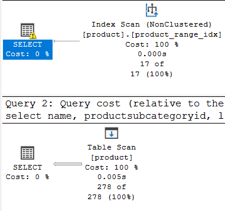
> 
> Indeksy z warunkiem (ang. filtered index) są tworzone na kolumnach, 
> które często występują w warunkach zapytań, np. WHERE, HAVING itp. 
> W przypadku kolumn objętych indeksem z warunkiem, baza danych przechowuje nie tylko wartości kolumn, ale także dodatkowe informacje, które pozwalają na szybsze wyszukiwanie rekordów spełniających określone kryteria. 
> Kiedy zapytanie zawiera warunek oparty na kolumnie, dla której istnieje indeks z warunkiem, baza danych może użyć tego indeksu do szybkiego zlokalizowania pasujących rekordów. Dzięki temu operacje wyszukiwania są wykonywane szybciej, co przyspiesza działanie zapytań.

# Zadanie 2 – indeksy klastrujące

Celem zadania jest poznanie indeksów klastrujących

Skopiuj ponownie tabelę SalesOrderHeader do swojej bazy danych:

```sql
select * into salesorderheader2 from adventureworks2017.sales.salesorderheader
```


Wypisz sto pierwszych zamówień:

```sql
select top 1000 * from salesorderheader2  
order by orderdate
```

Stwórz indeks klastrujący według OrderDate:

```sql
create clustered index order_date2_idx on salesorderheader2(orderdate)
```

Wypisz ponownie sto pierwszych zamówień. Co się zmieniło?

---
> Wyniki: 
>
> 
> Przed wykorzystaniem indeksu:
> 
> 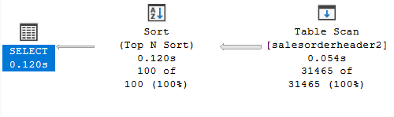
> 
> 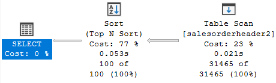
> 
> 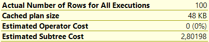
> 
> 
> Po wykorzystaniu indeksu:
> 
>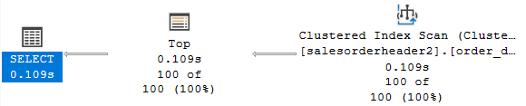
> 
> 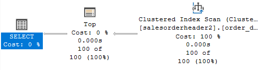
> 
> 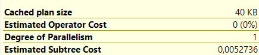
> 
> Czas wykonywania zapytania nie ulega znacznej poprawie. Sporą różnicę można natomiast zauważyć w koszcie zapytania. Zapewne wynika on z tego, że przy
> NIE użyciu indeksu 77% kosztu jest używane na sortowanie po skanie tablicy, natomiast w zapytaniu z użytym indeksem całość kosztu zapytania
> jest w momencie przeglądania tablicy z nałożonym indeksem.
> 
> W tym przypadku nałożenie indeksu nie wpływa na czas zapytania, ale znacząco obniża zużycie zasobów.
>
>**Eksperyment**: dla 1000 pierwszych wierszy.
> 
> Bez indeksu:
>
>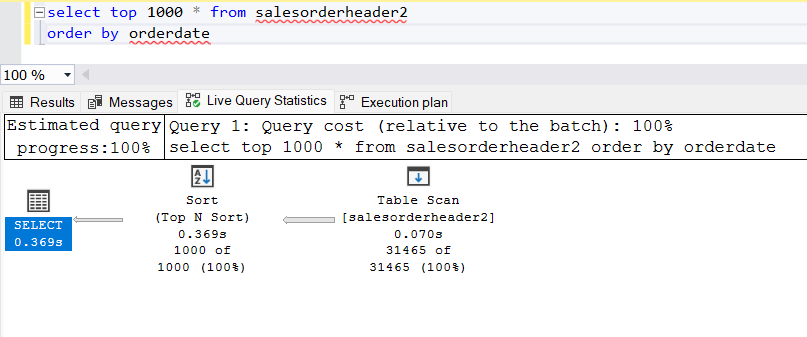
> 
>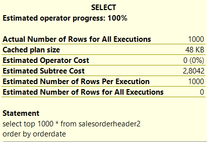
>
>Z indeksem:
>
>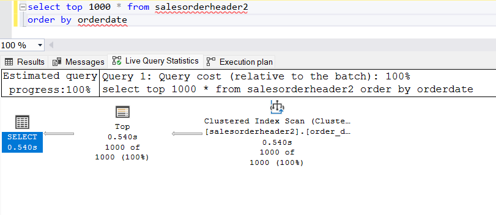
> 
>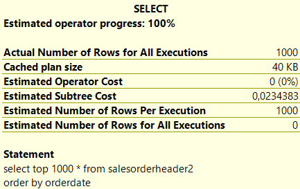
> 
> * Koszty: przed nałożeniem indeksu około 2.8, po nałożeniu indeksu około 0.023. Koszt jest około 120 mniejszy po nałożeniu indeksu 
> * Czasy: przed nałożeniem indeksu około 390 ms, po nałożeniu indeksu około 540 ms. Czas jest dłuższy po nałożeniu indeksu 
> * Plany wykonania zapytań:
> * * Przed nałożeniem indeksu w planie wykonania pojawia się blok Table Scan skanujący wszystkie wiersze tabeli oraz blok sortujący wiersze. Poszczególne koszty są następujące: 23% na skanowanie tabeli i 77% na sortowanie. 
> * * Po nałożeniu indeksu w planie są bloki Clustered Index Scan, skanujący indeks. Następnie występuje operator Top, który ponownie skanuje input i wybiera tylko N pierwszych wierszy. Koszty są rozłożone następująco: blisko 100% całościowego kosztu na Clustered Index Scan i blisko 0% na operację Top. 
> 
> Wynika stąd, że brak jest korelacji między czasem a kosztem. Chociaż czas wykonania zapytania bez indeksu jest krótszy, to zapytanie to zużywa więcej zasobów, co jest związane ze zwiększonym kosztem, zwłaszcza w przypadku operacji sortowania.
> 
> 

Sprawdź zapytanie:

```sql
select top 100 * from salesorderheader2  
where orderdate between '2010-10-01' and '2011-06-01'
```


Dodaj sortowanie według OrderDate ASC i DESC. Czy indeks działa w obu przypadkach. Czy wykonywane jest dodatkowo sortowanie?


---
> Wyniki: 
> 
> 
> 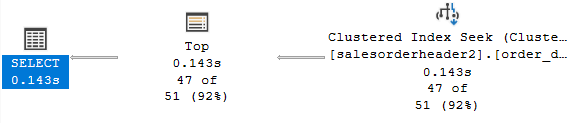
> 

```sql
select top 100 * from salesorderheader2  
where orderdate between '2010-10-01' and '2011-06-01'
order by OrderDate ASC

select top 100 * from salesorderheader2  
where orderdate between '2010-10-01' and '2011-06-01'
order by OrderDate DESC
```

>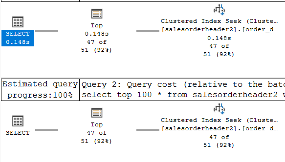
> 
> Przy nałożniu sortowania ASC i DESC nie zauważyłem żadnych zmian, jeśli chodzi o sposób wykonania zapytania.
> Koszt zapytania również nie uległ zmianie.
> Indeks został użyty w obu przypadkach.


# Zadanie 3 – indeksy column store


Celem zadania jest poznanie indeksów typu column store

Utwórz tabelę testową:

```sql
create table dbo.saleshistory(  
 salesorderid int not null,  
 salesorderdetailid int not null,  
 carriertrackingnumber nvarchar(25) null,  
 orderqty smallint not null,  
 productid int not null,  
 specialofferid int not null,  
 unitprice money not null,  
 unitpricediscount money not null,  
 linetotal numeric(38, 6) not null,  
 rowguid uniqueidentifier not null,  
 modifieddate datetime not null  
 )
```

Załóż indeks:

```sql
create clustered index saleshistory_idx  
on saleshistory(salesorderdetailid)
```


Wypełnij tablicę danymi:

(UWAGA    `GO 100` oznacza 100 krotne wykonanie polecenia. Jeżeli podejrzewasz, że Twój serwer może to zbyt przeciążyć, zacznij od GO 10, GO 20, GO 50 (w sumie już będzie 80))

```sql
insert into saleshistory  
 select sh.*  
 from adventureworks2017.sales.salesorderdetail sh  
go 100
```

Sprawdź jak zachowa się zapytanie, które używa obecny indeks:

```sql
select productid, sum(unitprice), avg(unitprice), sum(orderqty), avg(orderqty)  
from saleshistory  
group by productid  
order by productid
```

Załóż indeks typu ColumnStore:

```sql
create nonclustered columnstore index saleshistory_columnstore  
 on saleshistory(unitprice, orderqty, productid)
```

Sprawdź różnicę pomiędzy przetwarzaniem w zależności od indeksów. Porównaj plany i opisz różnicę.


---
> Wyniki: 
> 
> Zachowanie zapytania z poprzednim indeksem:
> 
> 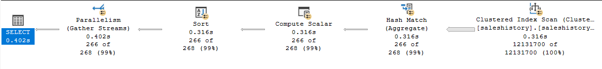
> 
> 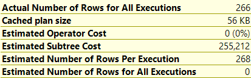
> 
> 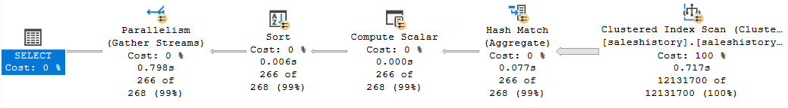
> 
> Komentarz do indeksu klastrowanego:
> W planie wykonania zapytania pojawiają się następujące operacje;
> * Clustered index scan, czyli operacja skanowania indeksu klastrowanego polega na przeglądaniu wszystkich wierszy w indeksie, zamiast szybkiego wyszukiwania konkretnego wiersza. Jest mniej optymalna od Clustered index Seek, bo przegląda cały indeks. Zazwyczaj stosowana jest do większych tabel. Jest to mniej optymalny sposób wykorzystania indeksu. 
> * Hash Match - buduje tabelę skrótów, aby znaleźć dopasowania wierszy. Operacja Hash Match jest używana do agregacji danych. 
> * Compute Scalar - jako wejście przyjmuje wyjście z Hash Match i oblicza wartość sklaraną wyrażenia (wartości agregacji np. sumy)
> * Blok Sort odpowiada za sortowanie wyników związane z operacja order by productid 
> * Blok Parallelism łączy strumienie danych, czyli poprzednie operacje były wykonywane równolegle dla więcej niż jednego strumienia danych.
>
> Można zauważyć, że indeks nie jest wykorzystany w optymalny sposób. Przykładowo, nie wykorzystujemy struktury indeksu aby zlokalizować szybko wiersze, tylko korzystamy z mniej wydajnego Index Scan, opnieważ to zapytanie odnosi się do większej liczby wierszy.
>
> Analiza Kosztów:
> * Koszt całego zapytania to około 255
> * Blisko 100% całościowego kosztu przypada na operację Clustered Index Scan (około 254)
> * Blisko 0% (ale najwięcej z pozostałych operacji) przypada na Hash Match (około 1)
> * Pozostałe koszty bardzo bliskie 0
> 
> Zachowanie zapytania po nałożeniu columnstore:
> 
> 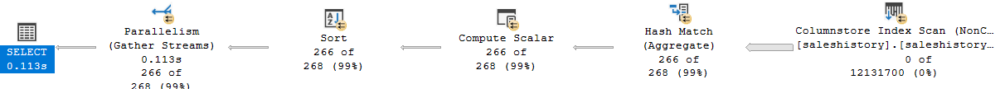
> 
> 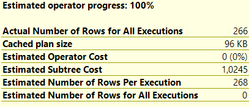
> 
> 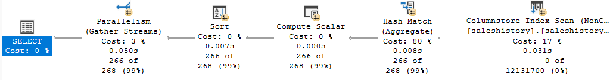
> 
> Przy użyciu columnstore zapytanie okazało się prawie 4 razy szybsze niż poprzednio; charakteryzuje się ono też znacznie mniejszym
> zużyciem zasobów.
> Plan zapytania się nie zmienił.
> 
> Co również można zaobserwować, to przerzucenie kosztu obliczeń na Hash Match. Może to sugerować, że  indeks columnstore doskonale nadaje się do wykonywania zapytań analizy danych, takich jak zapytania agregujące, sortowanie, grupowanie i filtrowanie danych. 
> Dzięki przechowywaniu danych w formie kolumnowej, zapytania te mogą być wykonywane znacznie szybciej niż w przypadku tradycyjnych indeksów.
> 
> Warto używać indeksu columnstore w sytuacjach, gdy:
>* Dane są duże i wymagają efektywnego przetwarzania analitycznego. 
>* Wiele zapytań wymaga przetwarzania dużych ilości danych. 
>* Zapytania obejmują operacje agregujące, sortowanie lub grupowanie. 
>* Istnieje potrzeba zoptymalizowania wydajności zapytań raportowych.
>
> 
> **Porównanie:**
> 
> Można zaobserwować, że koszt operacji Hash Match pozostał niemalże niezmieniony przy użyciu indeksu typu ColumnStore w porównaniu z wykorzystaniem indeksu klastrowanego wierszowego (obejmuje to koszt około 1.048 dla obu przypadków). Natomiast znacząco zmienił się koszt pierwszej operacji, tj. skanowania indeksu. 
> 
> Z tego można wywnioskować, że szczególnie dla dużych tabel lepszym podejściem może być nakładanie indeksu typu nonclustered na określone kolumny zamiast korzystania z indeksu klastrowanego wierszowego.
> 
> 

# Zadanie 4 – własne eksperymenty

Należy zaprojektować tabelę w bazie danych, lub wybrać dowolny schemat danych (poza używanymi na zajęciach), a następnie wypełnić ją danymi w taki sposób, aby zrealizować poszczególne punkty w analizie indeksów. Warto wygenerować sobie tabele o większym rozmiarze.

Do analizy, proszę uwzględnić następujące rodzaje indeksów:
- Klastrowane (np.  dla atrybutu nie będącego kluczem głównym)
- Nieklastrowane
- Indeksy wykorzystujące kilka atrybutów, indeksy include
- Filtered Index (Indeks warunkowy)
- Kolumnowe

## Analiza

Proszę przygotować zestaw zapytań do danych, które:
- wykorzystują poszczególne indeksy
- które przy wymuszeniu indeksu działają gorzej, niż bez niego (lub pomimo założonego indeksu, tabela jest w pełni skanowana)
Odpowiedź powinna zawierać:
- Schemat tabeli
- Opis danych (ich rozmiar, zawartość, statystyki)
- Trzy indeksy:
- Opis indeksu
- Przygotowane zapytania, wraz z wynikami z planów (zrzuty ekranow)
- Komentarze do zapytań, ich wyników
- Sprawdzenie, co proponuje Database Engine Tuning Advisor (porównanie czy udało się Państwu znaleźć odpowiednie indeksy do zapytania)


> Wyniki: 
>
> Przygotowana tabela do eksperymentów: 

```sql
 CREATE DATABASE SampleDatabase;
GO

USE SampleDatabase;
GO

CREATE TABLE SampleTable (
    id INT PRIMARY KEY,
    name VARCHAR(50),
    age INT,
    gender CHAR(1),
    email VARCHAR(100),
    salary DECIMAL(10,2),
    join_date DATE,
    is_active INT
);

DECLARE @counter INT = 1;

WHILE @counter <= 2000000
BEGIN
    INSERT INTO SampleTable (id, name, age, gender, email, salary, join_date, is_active)
    VALUES (
        @counter,
        CONCAT('Person', @counter),
        CAST(ROUND(RAND() * 50 + 18, 0) AS INT),
        CASE WHEN RAND() > 0.5 THEN 'M' ELSE 'F' END,
        CONCAT('person', @counter, '@example.com'),
        ROUND(RAND() * 5000 + 30000, 2),
        DATEADD(DAY, -CAST(ROUND(RAND() * 3650, 0) AS INT), GETDATE()),
        CASE WHEN RAND() > 0.2 THEN 1 ELSE 0 END
    );
    
    SET @counter = @counter + 1;
END;

-- if you want to start from previous point

DECLARE @counter INT;
SELECT @counter = ISNULL(MAX(id), 0) FROM SampleTable;

WHILE @counter < 1000000 -- <- adapt number of records you want to achive
BEGIN
    SET @counter = @counter + 1;
    IF NOT EXISTS (SELECT 1 FROM SampleTable WHERE id = @counter)
    BEGIN
        INSERT INTO SampleTable (id, name, age, gender, email, salary, join_date, is_active)
        VALUES (
            @counter,
            CONCAT('Person', @counter),
            CAST(ROUND(RAND() * 50 + 18, 0) AS INT),
            CASE WHEN RAND() > 0.5 THEN 'M' ELSE 'F' END,
            CONCAT('person', @counter, '@example.com'),
            ROUND(RAND() * 5000 + 30000, 2),
            DATEADD(DAY, -CAST(ROUND(RAND() * 3650, 0) AS INT), GETDATE()),
            CASE WHEN RAND() > 0.2 THEN 1 ELSE 0 END
        );
    END;
END;
```
> Powyższy kod SQL tworzy bazę danych o nazwie SampleDatabase, tworzy w niej tabelę SampleTable z kolumnami id, name, age, gender, email, salary, join_date oraz is_active. Następnie wypełnia tabelę SampleTable 2 milionami rekordów. Każdy rekord zawiera unikalne ID, losowe imię i nazwisko (składające się z frazy "Person" i numeru rekordu), losowy wiek między 18 a 68 rokiem życia, losową płeć, losowy adres e-mail, losową pensję, losową datę dołączenia (z ostatnich 10 lat) oraz losową wartość logiczną reprezentującą czy rekord jest aktywny czy nie.
> 
> W tabeli zostały użyte rózne typy danych co umożliwia ocenę wpływu różnych rodzajów indeksów na wydajność zapytań.
> Ponadto, wygenerowanie 2 milionów rekordów umożliwia przeprowadzenie wiarygodnej oceny czasów wykonania zapytań, co pozwala na trafne wnioski dotyczące wydajności i kosztów związanych z różnymi indeksami.
> 
> 
> Zrzut ekranu z tabeli:
> 
> 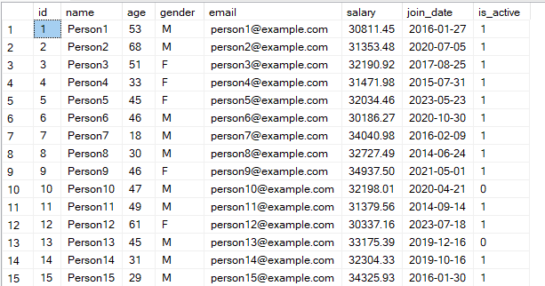
>
> 
> 
> ### Eksperyment 1.
> 
> W poprzednim zadaniu nasunął się wniosek, że indeks colmnstore dobrze nada się do zapytań korzystających z grupowania i agregowania wartości w kolumnach. Do przetestowania tej teorii
> stworzymy zapytanie, które grupuje rekordy np. po płci oraz policzy średnią wartość ich zarobków.
```sql
SELECT gender, is_active, AVG(salary) AS average_salary, COUNT(*) AS num_people
FROM SampleTable
GROUP BY gender, is_active;
```
> 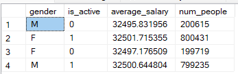
> 
> 
> Wykonanie zapytania w podstawowej formie: 112ms
> 
> 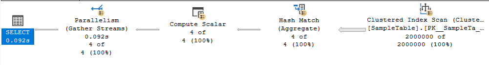
> 
```sql
CREATE COLUMNSTORE INDEX idx_SampleTable_ColumnStore ON SampleTable
(
    id, name, age, gender, email, salary, join_date, is_active
);
```
> 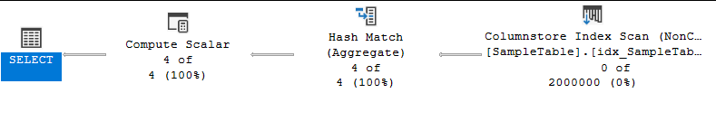
> 
> Co ciekawe jeśli choćby jedna z kolumn uwzględniona w zapytaniu (nie zależnie od tego czy znajduje się w warunku grupowania czy select) nie zostanie objęta indeksem columns store. Całe zapytanie powraca do użycia 
> indeksu klasterowego. 
> Jeśli spróbujemy wymusić użycie columnstore czas zapytania zwiększa się kilkukrotnie. (1,117 s)
> 
> 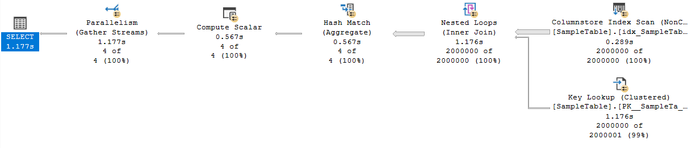
>
> 
> ### Eksperyment 2.
> Zwykły indeks to struktura, która przechowuje wartości wybranych kolumn w sposób umożliwiający szybkie przeszukiwanie i sortowanie. Każda kolumna w indeksie standardowym wpływa na to, jak dane są organizowane i jak szybko można je przeszukać.
> Indeks z INCLUDE pozwala dodać dodatkowe kolumny do indeksu, które nie są używane do sortowania danych, ale są dostępne podczas wykonywania zapytań. Umożliwia to szybsze zapytania, które potrzebują dostępu do tych kolumn, bez dodatkowego kosztu reorganizacji całego indeksu przy aktualizacji tych kolumn.
```sql
SELECT name, email, salary
FROM SampleTable
WHERE age = 30
ORDER BY join_date DESC;
```
> 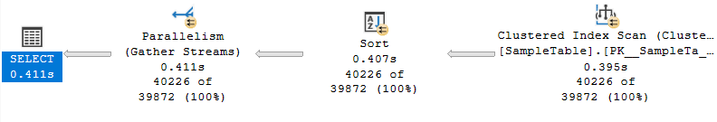

```sql
CREATE INDEX idx_age_join_date_include ON SampleTable (age, join_date)
INCLUDE (name, email, salary);
```
>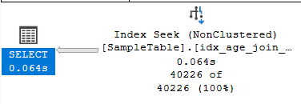
> 
> ### Eksperyment 3 - Indeks warunkowy (filtered index)
>Zgodnie z dokumentacją indeksu warunkowego: *W każdym przypadku klauzula WHERE zapytania powinna być podzbiorem klauzuli WHERE przefiltrowanego indeksu, aby skorzystać z przefiltrowanego indeksu.*
>
>Eksperyment będzie polegał na odwróceniu tej sytuacji i utworzeniu indeksu, którego warunek jest podzbiorem warunku WHERE z zapytania.

```sql
-- Zapytanie --
select *
from SampleTable 
where age > 50;

-- Indeks --
CREATE INDEX idx_filtered ON SampleTable (id) 
WHERE age > 50 and gender = 'M' and salary > 33000;
```


>Przed nałożeniem indeksu:
>
>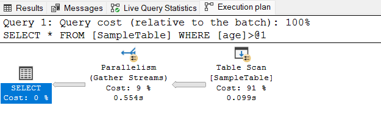
> 
>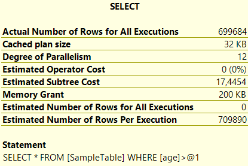
>
>Po nałożeniu indeksu:
>
>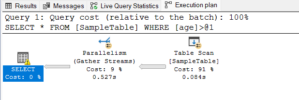
> 
>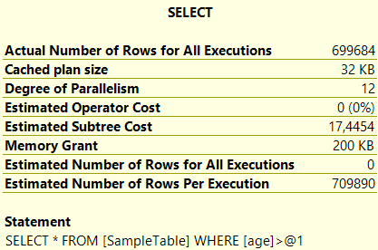

```sql
select *
from SampleTable with(index(idx_filtered))
where age > 50;
```

>Próba wymmuszenia indeksu:
>
>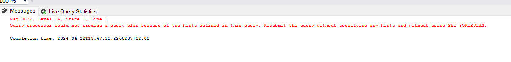
>
>**Komentarz:**
>
>Próba wymuszenia indeksu kończy się niepowodzeniem. Optymalizator nie jest w stanie użyć niewłaściwego indeksu do zapytania.
>Przed i po nałożeniu indeksu, tabela jest w pełni skanowana.

### Eksperyment 4 - Indeks nieklastrowany

>Jak czytamy w dokumentacji, indeksy nieklastrowane dobrze sprawdzają się do optymalizacji operacji grupowania. W tym eksperymencie, chcemy sprawdzić jak indeks nieklastrowany zachowa się gdy indeks nałożymy tylko na kolumnę grupowania vs. gdy nałożymy na kolumnę grupowania i agregacji.

```sql
-- Zapytanie --
SELECT age, AVG(salary) AS avg_salary
FROM SampleTable 
GROUP BY age;

-- Indeks --
CREATE NONCLUSTERED INDEX nonclustered_idx ON SampleTable(age);
```
>
>Przed nałożeniem indeksu:
>
>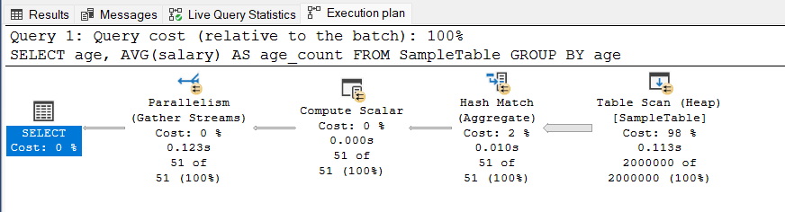
> 
>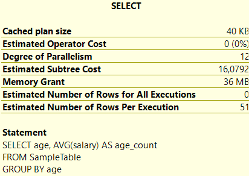
>
>Po nałożeniu indeksu:
>
>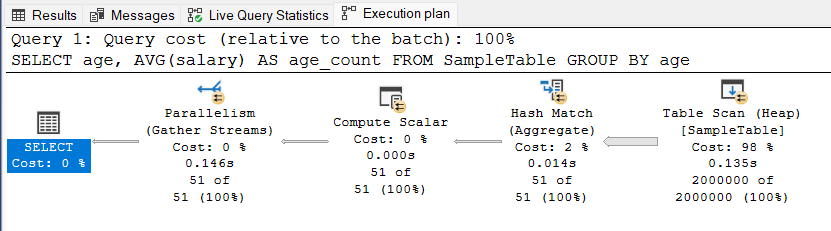
> 
>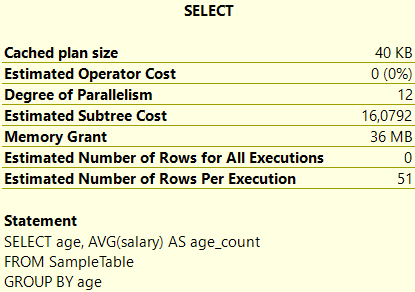

```sql
-- Wymuszenie indeksu --
SELECT age, AVG(salary) AS age_count
FROM SampleTable with(index(nonclustered_idx))
GROUP BY age;
```

>**Komentarz:**
>
>Indeks nakładamy tylko na kolumnę age, według której odbywa się grupowanie. Dodatkowo wykonujemy operację obliczenia średniej wartości wynagrodzenia dla danego wieku pracownika. Jak widać, optymalizator nie używa domyślnie indeksu, tylko skanuje całą tabelę. Sprawdźmy co się stanie gdy wymusimy indeks.
>
>Po wymuszeniu indeksu:
>
>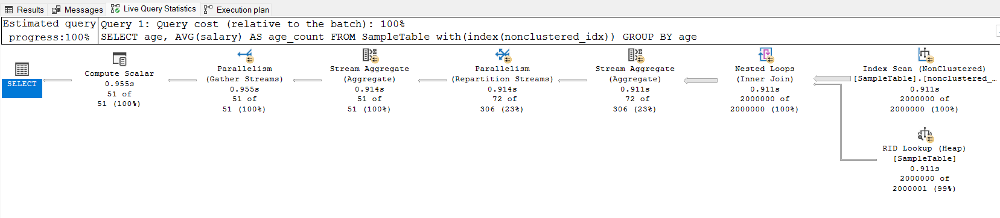
> 
>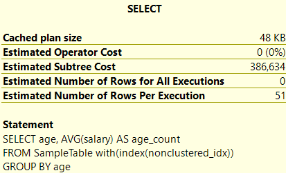
>
>
>**Komentarz**:
>
>Po wymuszeniu indeksu okazuje się, że plan wykonania zapytania staje się bardziej skomplikowany. 
>
>Analiza planu wykonania:
> * W przypadku poprzedniego planu wykonania mieliśmy operacje Table Scan do skanowania wszystkich wierszy, następnie Hash Match do agregacji, Compute Scalar do wyliczenia pojedynczej średniej wartości dla grupy, oraz Parallelism do połączenia równoległych wyników. 
> * Przy wymuszeniu indeksu mamy Index Scan do skanowania indeksu, potem RID Lookup oraz Nested Loops (Inner Join) do doklejenia pozostałych kolumn (salary) do wyniku. Następnie blok Stream Aggregate, który grupuje dane według wieku i oblicza średnią płacę dla grupy, potem Parallelism (Repartition Stream), gdzie dane są rozpraszane między różne wątki przetwarzania równoległego (Repartition Streams), aby przetwarzać grupy danych niezależnie. Potem ponownie Stream Aggregate, aby obliczyć końcowe wyniki średniej płacy dla każdej grupy wiekowej i Parallelism (Gather Streams) aby zebrać wyniki z wątków i połączyć w jedno.
>
>Analiza kosztu:
> * Bez indeksu mamy koszt około 16, z indeksem mamy koszt około 386. Koszt zwiększa się ponad 20 krotnie.
>
>Sprawdźmy co się stanie, gdy indeks zostanie nałożony zarówno na kolumnę 'age', jak i 'salary'.

```sql
-- Nowy indeks na age i salary --
CREATE NONCLUSTERED INDEX nonclustered_idx_age_salary ON SampleTable(age, salary);
```
>
>Próba poprawy indeksu:
>
>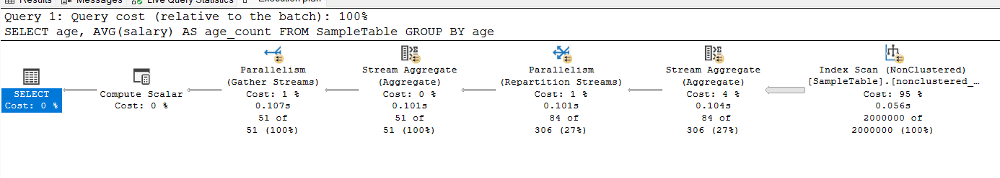
> 
>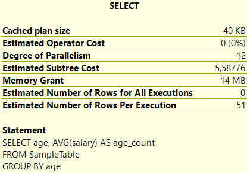
>
>**Komentarz:**
>
>Indeks nieklastrowany, który uwzględnia zarówno kolumnę age, jak i salary jest optymalny. Koszt wynosi około 5, czyli jest mniejszy około 3 razy w porównaniu do przypadku bez żadnego indeksu. W planie wykonania zapytania mamy operację przeszukania indeksu, oraz agregację i parallelism do rozproszenia i połączenia równoległych strumieni danych. Co ciekawe, w zapytaniu nie musimy wymuszać indeksu `nonclustered_idx_age_salary`. Jest on używany przez optymalizator automatycznie.


|         |     |     |     |
| ------- | --- | --- | --- |
| zadanie | pkt |     |     |
| 1       | 2   |     |     |
| 2       | 2   |     |     |
| 3       | 2   |     |     |
| 4       | 10  |     |     |
| razem   | 16  |     |     |
