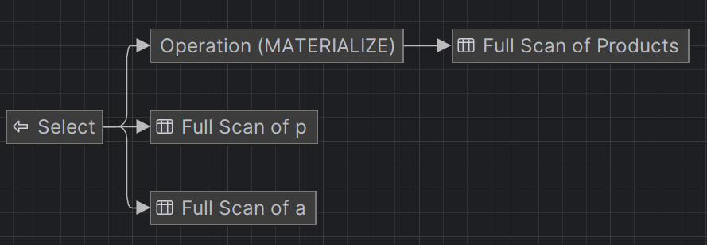
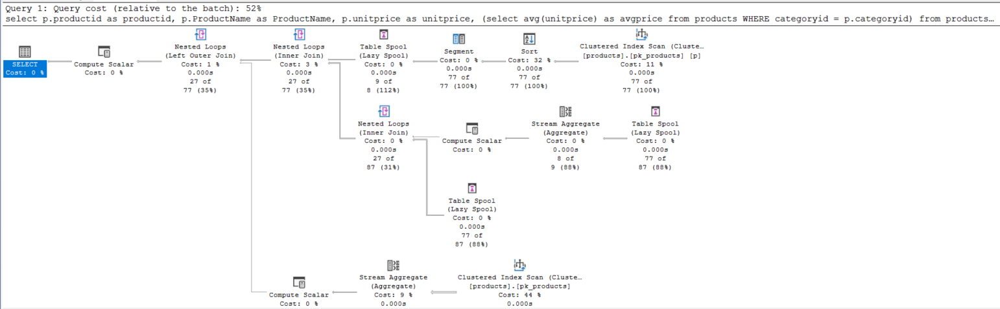
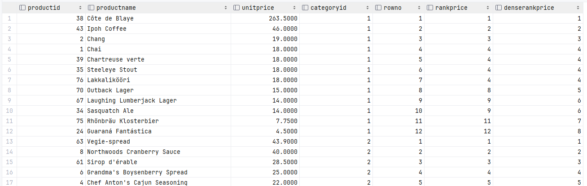
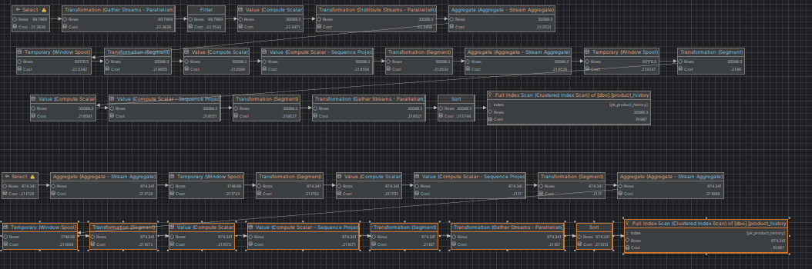

# SQL - Funkcje okna (Window functions) 

# Lab 1-2

---
**Imię i nazwisko:** Ewa Pelc, Kacper Sobczyk

--- 


Celem ćwiczenia jest zapoznanie się z działaniem funkcji okna (window functions) w SQL, analiza wydajności zapytań i porównanie z rozwiązaniami przy wykorzystaniu "tradycyjnych" konstrukcji SQL

Swoje odpowiedzi wpisuj w miejsca oznaczone jako:

```sql
-- wyniki ...
```

Ważne/wymagane są komentarze.

Zamieść kod rozwiązania oraz zrzuty ekranu pokazujące wyniki, (dołącz kod rozwiązania w formie tekstowej/źródłowej)

Zwróć uwagę na formatowanie kodu

---

## Oprogramowanie - co jest potrzebne?

Do wykonania ćwiczenia potrzebne jest następujące oprogramowanie:
- MS SQL Server - wersja 2019, 2022
- PostgreSQL - wersja 15/16
- SQLite
- Narzędzia do komunikacji z bazą danych
	- SSMS - Microsoft SQL Managment Studio
	- DtataGrip lub DBeaver
-  Przykładowa baza Northwind
	- W wersji dla każdego z wymienionych serwerów

Oprogramowanie dostępne jest na przygotowanej maszynie wirtualnej

## Dokumentacja/Literatura

- Kathi Kellenberger,  Clayton Groom, Ed Pollack, Expert T-SQL Window Functions in SQL Server 2019, Apres 2019
- Itzik Ben-Gan, T-SQL Window Functions: For Data Analysis and Beyond, Microsoft 2020

- Kilka linków do materiałów które mogą być pomocne
	 - https://learn.microsoft.com/en-us/sql/t-sql/queries/select-over-clause-transact-sql?view=sql-server-ver16
	- https://www.sqlservertutorial.net/sql-server-window-functions/
	- https://www.sqlshack.com/use-window-functions-sql-server/
	- https://www.postgresql.org/docs/current/tutorial-window.html
	- https://www.postgresqltutorial.com/postgresql-window-function/
	-  https://www.sqlite.org/windowfunctions.html
	- https://www.sqlitetutorial.net/sqlite-window-functions/

- Ikonki używane w graficznej prezentacji planu zapytania w SSMS opisane są tutaj:
	- [https://docs.microsoft.com/en-us/sql/relational-databases/showplan-logical-and-physical-operators-reference](https://docs.microsoft.com/en-us/sql/relational-databases/showplan-logical-and-physical-operators-reference)

---
# Zadanie 1 - obserwacja

Wykonaj i porównaj wyniki następujących poleceń.

```sql
select _avg_(unitprice) avgprice
from products p;

select _avg_(unitprice) over () as avgprice
from products p;

select categoryid, _avg_(unitprice) avgprice
from products p
group by categoryid

select _avg_(unitprice) over (partition by categoryid) as avgprice
from products p;
```

Jaka jest są podobieństwa, jakie różnice pomiędzy grupowaniem danych a działaniem funkcji okna?

## Komentarz
* Zapytanie (1) oblicza średnią cenę z całej tabeli products. 
* Zapytanie (2) oblicza średnią cenę dla każdego rekordu, używając danych z całej tabeli products. 
* Zapytanie (3) oblicza średnią cenę dla każdej kategorii produktów. 
* Zapytanie (4) przypisuje każdemu rekordowi średnią cenę z jego kategorii.

W obu przypadkach zostaje wyliczona pewna wartość funkcji agregującej.

Różnicą natomiast, jest liczba wierszy wynikowych. Przy zastosowaniu grupowania danych i funkcji agregującej średniej, dostajemy średnią wartość dla każdej grupy, tzn. tyle wierszy wynikowych ile jest grup. W przypadku funkcji okna, każdemu wierszowi przypisana jest odpowiednia wartość średnia bazując na tym do jakiej grupy należy dany wiersz, tzn. wierszy wynikowych jest tyle ile wszystkich wierszy w tabeli.


---
# Zadanie 2 - obserwacja

Wykonaj i porównaj wyniki następujących poleceń.

```sql
--1)

select p.productid, p.ProductName, p.unitprice,
       (select _avg_(unitprice) from products) as avgprice
from products p
where productid < 10

--2)
select p.productid, p.ProductName, p.unitprice,
       _avg_(unitprice) over () as avgprice
from products p
where productid < 10
```

Jaka jest różnica? Czego dotyczy warunek w każdym z przypadków? 

## Komentarz
W obu przypadkach warunek dotyczy ograniczenia pokazywanych wierszy do pierwszych 10 rekordów z id < 10.

W przypadku pierwszego zapytania natomiat avg price pokazuje średnią wartość ceny dla całej tabeli.
Natomiast drugie zapytanie faktycznie ogranicza średnią wartość ceny do pokazanych 10 rekordów.

To znaczy że w przypadku funkcji okna, przy liczeniu średniej brany jest pod uwagę (zewnętrzny) warunek WHERE. W podzapytaniu nie jest on brany pod uwagę.

---

Napisz polecenie równoważne 
- 1) z wykorzystaniem funkcji okna. Napisz polecenie równoważne 

```sql
SELECT TOP 9 p.ProductID, p.ProductName, p.UnitPrice,
         AVG(UnitPrice) OVER () AS AvgPrice
FROM Products p;
```


- 2) z wykorzystaniem podzapytania

```sql
SELECT p.ProductID, p.ProductName, p.UnitPrice,
       (SELECT AVG(UnitPrice) FROM Products WHERE ProductID < 10) AS AvgPrice
FROM Products p
WHERE p.ProductID < 10;
```


# Zadanie 3

Baza: Northwind, tabela: products

Napisz polecenie, które zwraca: id produktu, nazwę produktu, cenę produktu, średnią cenę wszystkich produktów.

Napisz polecenie z wykorzystaniem z wykorzystaniem podzapytania, join'a oraz funkcji okna. Porównaj czasy oraz plany wykonania zapytań.

Przetestuj działanie w różnych SZBD (MS SQL Server, PostgreSql, SQLite)

W SSMS włącz dwie opcje: Include Actual Execution Plan oraz Include Live Query Statistics


W DataGrip użyj opcji Explain Plan/Explain Analyze


## Zapytania
```sql
-- subquery
SELECT 
    p.ProductID, 
    p.ProductName, 
    p.UnitPrice,
    (SELECT AVG(UnitPrice) FROM Products) AS AvgPrice
FROM 
    Products p;

-- window function
SELECT 
    p.ProductID, 
    p.ProductName, 
    p.UnitPrice,
    AVG(p.UnitPrice) OVER () AS AvgPrice
FROM 
    Products p;

-- join
SELECT 
    p.ProductID, 
    p.ProductName, 
    p.UnitPrice, 
    a.AvgPrice
FROM 
    Products p
CROSS JOIN 
    (SELECT AVG(UnitPrice) AS AvgPrice FROM Products) a;
```

Output zapytania:


## Porównanie czasów

| Rodzaj zapytania | SQL Server | SQLite | PostgreSQL |
|------------------|------------|--------|------------|
| Podzapytanie     | 68 ms      | 25 ms  | 24 ms      |
| Join             | 70 ms      | 20 ms  | 26 ms      |
| Funkcja okna     | 70 ms      | 25 ms  | 27 ms      |

## Porównanie planów zapytań
### SQL Server
Subquery


Window function


Join


## Komentarz

Plany wykonania zapytania w SQL Server są bardzo podobne dla podzapytania oraz joina, mają też podobny koszt około 0.007 

Plan wykonania dla funkcji okna jest bardziej rozbudowany i składa się z  dodatkowych transformacji, jednak sumaryczny koszt jest mniejszy.

Dodatkowo, w przypadku funkcji okna występuje blok Temporary (Lazy Spool). Oznacza to, że w trakcie wykonywania zapytania baza danych tworzy tymczasową strukturę danych, którą wykorzystuje do przechowywania wyników pośrednich, a następnie przetwarza te wyniki dalej.

### SQLite
Subquery


Window function


Join



## Komentarz

Dla SQLite na planie wykonania zapytania nie widać kosztu operacji. Jeśli chodzi o strukturę planu, to można zauważyć, że dla join operacja skanowania całej tabeli (Full Scan) wykonywana jest 3 razy, w pozostałych zapytaniach tylko 2. 

Może to potencjalnie świadczyć, że zapytanie za pomocą join jest gorzej zoptymalizowane (?), ale dla tak małego zbioru danych wyciąganie wniosków nie byłoby obiektywne.

### PostgreSQL
Subquery


Window function


Join


## Komentarz do PostgreSQL

W przypadku planu wykonania zapytania dla PostgreSQL, widać że sumaryczny koszt dla funkcji okna jest znacznie mniejszy niż dla podzapytania i joina. Wydaje się, że mimo małego rozmiaru tabeli na której wykonujemy zapytanie już można dostrzec przewagę funkcji okna nad pozostałymi metodami.

Dodatkowa uwaga, to że w przypadku join występuje operacja Nested Loop Join służąca do łączenia danych z różnych tabel. Dla większych, nieindeksowanych tabel mogłaby ona potencjalnie prowadzić do wolniejszych operacji łączenia.


## Komentarz do wszystkich

SQLite i PostgreSQL w tym zapytanie niezależnie od zastosowanej metody cechowało się lepszym czasem wykonania zapytania.
W przypadku tak krótkich czasów wykonania, liczonych w milisekundach nie da się obiektywnie ocenić wydajności powyższych metod.


# Zadanie 4

Baza: Northwind, tabela products

Napisz polecenie, które zwraca: id produktu, nazwę produktu, cenę produktu, średnią cenę produktów w kategorii, do której należy dany produkt. Wyświetl tylko pozycje (produkty) których cena jest większa niż średnia cena.

Napisz polecenie z wykorzystaniem podzapytania, join'a oraz funkcji okna. Porównaj zapytania. Porównaj czasy oraz plany wykonania zapytań.

Przetestuj działanie w różnych SZBD (MS SQL Server, PostgreSql, SQLite)

## Zapytania

```sql
-- subquery
-- (in the subquery I'm refering to outer table, also in the WHERE condition I repeat the same subquery)
SELECT p.ProductID AS ProductID,
       p.ProductName AS ProductName,
       p.UnitPrice AS UnitPrice,
       (SELECT AVG(UnitPrice) AS AvgPrice FROM Products WHERE CategoryID = p.CategoryID)
FROM Products p
WHERE UnitPrice > (SELECT AVG(UnitPrice) AS AvgPrice FROM Products WHERE CategoryID = p.CategoryID);


-- window function (I use outer SELECT clause to filter the results)
SELECT * FROM (SELECT p.ProductID AS ProductID,
                      p.ProductName AS ProductName,
                      p.UnitPrice AS UnitPrice,
                      AVG(UnitPrice) OVER (PARTITION BY p.CategoryID) AS AvgPrice
FROM Products p) AS tmp
WHERE UnitPrice > AvgPrice;


-- join
SELECT p1.ProductID AS ProductID,
       p1.ProductName AS ProductName,
       p1.UnitPrice AS UnitPrice,
       p2.AvgPrice
FROM Products p1
LEFT JOIN (
SELECT CategoryID, AVG(UnitPrice) AS AvgPrice
FROM Products
GROUP BY CategoryID) p2 ON p1.CategoryID = p2.CategoryID
WHERE p1.UnitPrice > p2.AvgPrice;
```


## Porównanie planów wykonania i czasów

### SQL Server

Subquery:


Window function:


Join:


## Komentarz

Powyższe zrzuty ekranu zostały wykonane w SSMS, koszty wyrażone jako udział procentowy.

Koszt podzapytania to 52 %, pozostałych to 24%.

Zarówno w przypadku podzapytania jak i join widać, że największy koszt mają operacje Clustered Index Scan oraz Sort.

Plany wykonania zapytania dla joina  i funkcji okna są prawie identyczne, dla podzapytania plan jest bardziej rozbudowany.

### PostgreSQL

Subquery:


Window function:


Join:


## Komentarz

Dla PostgreSQL pozdzapytanie ma największy sumaryczny koszt wykonania. Dodatkowo, plan zawiera 3 pełne przeszukiwania tabeli za pomocą Full Scan. 

Nowy element tj. Hash Join występuje dla zapytania z join. Hash join jest to jedna z operacji wykonywania łączenia w bazach danych. Występowanie tego etapu może być szczególnie wydajne dla dużych tabel i kosztowne dla małych tabel.

### Sqlite

Subquery:


Window function:


Join:


## Komentarz do SQLite

Porównanie planów wykonania dla SQLite jest trudne z uwagi na brak wypisywania kosztu poszczególnych operacji. Każdy typ zapytania zawiera te same elementy, czyli Full Scan, Index Scan.

Dla funkcji okna jest podział na operacje (Operation CO-ROUTINE) - ten blok oznacza że zapytanie generuje wirtualne tablice np CTE.

## Porównanie czasów

| Rodzaj zapytania | SQL Server | SQLite | PostgreSQL |
|------------------|------------|--------|------------|
| Podzapytanie     | 68 ms      | 30 ms  | 26 ms      |
| Join             | 68 ms      | 27 ms  | 28 ms      |
| Funkcja okna     | 65 ms      | 26 ms  | 30 ms      |


## Komentarz do wszystkich

Tak jak w przypadku wcześniejszego zadania SQLite i PostgreSQL cechują się około 2 razy lepszym czasem wykonania zapytania.
W przypadku tak krótkich czasów wykonania, liczonych w milisekundach nie da się obiektywnie ocenić wydajności powyższych metod.


---
# Zadanie 5 - przygotowanie

Baza: Northwind

Tabela products zawiera tylko 77 wiersz. Warto zaobserwować działanie na większym zbiorze danych.

Wygeneruj tabelę zawierającą kilka milionów (kilkaset tys.) wierszy

Stwórz tabelę o następującej strukturze:

Skrypt dla SQL Server

```sql
create table product_history(
   id int identity(1,1) not null,
   productid int,
   productname varchar(40) not null,
   supplierid int null,
   categoryid int null,
   quantityperunit varchar(20) null,
   unitprice decimal(10,2) null,
   quantity int,
   value decimal(10,2),
   date date,
 constraint pk_product_history primary key clustered
    (id asc )
)
```

Wygeneruj przykładowe dane:

Dla 30000 iteracji, tabela będzie zawierała nieco ponad 2mln wierszy (dostostu ograniczenie do możliwości swojego komputera)

Skrypt dla SQL Server

```sql
declare @i int  
set @i = 1  
while @i <= 30000  
begin  
    insert product_history  
    select productid, ProductName, SupplierID, CategoryID,   
         QuantityPerUnit,round(RAND()*unitprice + 10,2),  
         cast(RAND() * productid + 10 as int), 0,  
         dateadd(day, @i, '1940-01-01')  
    from products  
    set @i = @i + 1;  
end;  
  
update product_history  
set value = unitprice * quantity  
where 1=1;
```


Skrypt dla Postgresql

```sql
create table product_history(
   id int generated always as identity not null  
       constraint pkproduct_history
            primary key,
   productid int,
   productname varchar(40) not null,
   supplierid int null,
   categoryid int null,
   quantityperunit varchar(20) null,
   unitprice decimal(10,2) null,
   quantity int,
   value decimal(10,2),
   date date
);
```

Wygeneruj przykładowe dane:

Skrypt dla Postgresql

```sql
do $$  
begin  
  for cnt in 1..30000 loop  
    insert into product_history(productid, productname, supplierid,   
           categoryid, quantityperunit,  
           unitprice, quantity, value, date)  
    select productid, productname, supplierid, categoryid,   
           quantityperunit,  
           round((random()*unitprice + 10)::numeric,2),  
           cast(random() * productid + 10 as int), 0,  
           cast('1940-01-01' as date) + cnt  
    from products;  
  end loop;  
end; $$;  
  
update product_history  
set value = unitprice * quantity  
where 1=1;
```


Wykonaj polecenia: `select count(*) from product_history`,  potwierdzające wykonanie zadania

### SQL Server


### PostgreSQL


Wykonanie polecenia wyżej (czas trwania dla potwierdzenia):

SQL Server 140 ms

SQLite 80 ms

PostgreSQL 230 ms

---
# Zadanie 6

Baza: Northwind, tabela product_history

To samo co w zadaniu 3, ale dla większego zbioru danych

Napisz polecenie, które zwraca: id pozycji, id produktu, nazwę produktu, cenę produktu, średnią cenę produktów w kategorii do której należy dany produkt. Wyświetl tylko pozycje (produkty) których cena jest większa niż średnia cena.

Napisz polecenie z wykorzystaniem podzapytania, join'a oraz funkcji okna. Porównaj zapytania. Porównaj czasy oraz plany wykonania zapytań.

Przetestuj działanie w różnych SZBD (MS SQL Server, PostgreSql, SQLite)

## Zapytania

```sql
-- subquery
SELECT p.id,
       p.productid AS productid,
       p.ProductName AS ProductName,
       p.unitprice AS unitprice,
       (SELECT AVG(unitprice) AS avgprice FROM product_history WHERE categoryid = p.categoryid)
FROM product_history p
WHERE unitprice > (SELECT AVG(unitprice) AS avgprice FROM product_history WHERE categoryid = p.categoryid)
ORDER BY p.id;


-- window function
SELECT * FROM (SELECT p.id AS id,
                      p.productid AS productid,
                      p.ProductName AS ProductName,
                      p.unitprice AS unitprice,
                      AVG(unitprice) OVER (PARTITION BY p.categoryid) AS avgprice
               FROM product_history p) AS tmp
WHERE unitprice > avgprice
ORDER BY id;


-- join
SELECT p1.id,
       p1.productid AS productid,
       p1.ProductName AS ProductName,
       p1.unitprice AS unitprice,
       p2.avgprice
FROM product_history p1
LEFT JOIN (SELECT categoryid, AVG(unitprice) AS avgprice
           FROM product_history
           GROUP BY categoryid) p2 ON p1.categoryid = p2.categoryid
WHERE p1.unitprice > p2.avgprice
ORDER BY p1.id;
```

## Porównanie czasów

| Rodzaj zapytania | SQL Server | SQLite        | PostgreSQL     |
|------------------|------------|---------------|----------------|
| Funkcja okna     | 5s 323 ms  | 538 ms        | 955 ms         |
| Podzapytanie     | 3s 838 ms  | 3m 30 s 519ms | 11m 16s 561 ms |
| Join             | 3s 575 ms  | 516 ms        | 488 ms         |


## Porównanie planów wykonania i czasów

### SQL Server

Subquery:


Window function:


Join:


## Komentarz

Dla SQL Server podzapytanie generuje najbardziej rozbudowany plan wykonania zapytania. Również sumaryczny koszt jest największy. Podzapytanie generuje kilka pełnych przeszukań tabeli oraz Hash Join.

Mimo, że plan dla funkcji okienkowej jest najmniej skomplikowany i ta metoda ma najmniejszy koszt, to jej wykonania jest najdłuższy w obrębie SQL serwera.

### PostgreSQL

Subquery:
*zbyt długi czas wykonania*

Window function:


Join:


## Komentarz

Brak zrzutu ekranu dla podzapytania w PostgreSQL jest spowodowany bardzo długim czasem wykonania.
Stąd też wniosek o największym sumarycznym koszcie podzapytania.

Funkcja okna ma większy sumaryczny koszt niż join. Dla funkcji okna największy koszt ma sortowanie. Tak samo jest dla join.

### Sqlite

Subquery:

Window function:

Join:


## Komentarz

Również brakuje zrzutu dla podzapytania z powodu długiego czasu wykonania. 

Podobne elementy w planach wykonania.

---
# Zadanie 7

Baza: Northwind, tabela product_history

Lekka modyfikacja poprzedniego zadania

Napisz polecenie, które zwraca: id pozycji, id produktu, nazwę produktu, cenę produktu oraz
-  średnią cenę produktów w kategorii do której należy dany produkt.
-  łączną wartość sprzedaży produktów danej kategorii (suma dla pola value)
-  średnią cenę danego produktu w roku którego dotyczy dana pozycja
- łączną wartość sprzedaży produktów danej kategorii (suma dla pola value)

Napisz polecenie z wykorzystaniem podzapytania, join'a oraz funkcji okna. Porównaj zapytania. W przypadku funkcji okna spróbuj użyć klauzuli WINDOW.

Porównaj czasy oraz plany wykonania zapytań.

Przetestuj działanie w różnych SZBD (MS SQL Server, PostgreSql, SQLite)


```sql
--dla SQL Server 
--podzapytanie
SELECT
    ph.ID,
    ph.ProductID,
    ph.ProductName,
    ph.UnitPrice,
    (
        SELECT AVG(sub.UnitPrice)
        FROM product_history sub
        WHERE sub.CategoryID = ph.CategoryID
    ) AS AvgCategoryPrice,
    (
        SELECT SUM(sub.Value)
        FROM product_history sub
        WHERE sub.CategoryID = ph.CategoryID
    ) AS TotalCategorySales,
    (
        SELECT AVG(sub.UnitPrice)
        FROM product_history sub
        WHERE sub.ProductID = ph.ProductID AND YEAR(sub.Date) = YEAR(ph.Date)
    ) AS AvgPriceThisYear
FROM product_history ph;


-- join
SELECT
    ph.ID,
    ph.ProductID,
    ph.ProductName,
    ph.UnitPrice,
    a.AvgCategoryPrice,
    a.TotalCategorySales,
    py.AvgPriceThisYear
FROM product_history ph
JOIN (
    SELECT
        CategoryID,
        AVG(UnitPrice) AS AvgCategoryPrice,
        SUM(Value) AS TotalCategorySales
    FROM product_history
    GROUP BY CategoryID
) a ON ph.CategoryID = a.CategoryID
JOIN (
    SELECT
        ProductID,
        YEAR(Date) AS SaleYear,
        AVG(UnitPrice) AS AvgPriceThisYear
    FROM product_history
    GROUP BY ProductID, YEAR(Date)
) py ON ph.ProductID = py.ProductID AND YEAR(ph.Date) = py.SaleYear;

-- funkcja okna
SELECT DISTINCT
    ph.ID,
    ph.ProductID,
    ph.ProductName,
    ph.UnitPrice,
    AVG(ph.UnitPrice) OVER (PARTITION BY ph.CategoryID) AS AvgCategoryPrice,
    SUM(ph.Value) OVER (PARTITION BY ph.CategoryID) AS TotalCategorySales,
    AVG(ph.UnitPrice) OVER (PARTITION BY ph.ProductID, YEAR(ph.Date)) AS AvgPriceThisYear
FROM product_history ph;
```


```sql
-- funkcja okna z window dla postgresql
SELECT DISTINCT
    ph.ID,
    ph.ProductID,
    ph.ProductName,
    ph.UnitPrice,
    AVG(ph.UnitPrice) OVER wCategory AS AvgCategoryPrice,
    SUM(ph.Value) OVER wCategory AS TotalCategorySales,
    AVG(ph.UnitPrice) OVER wProductYear AS AvgPriceThisYear
FROM (
    SELECT *,
        EXTRACT(YEAR FROM Date) AS SaleYear
    FROM product_history
) ph
WINDOW
    wCategory AS (PARTITION BY ph.CategoryID),
    wProductYear AS (PARTITION BY ph.ProductID, ph.SaleYear);
```
Porównaj czasy oraz plany wykonania zapytań.

| Rodzaj zapytania | SQL Server        | SQLite            | PostgreSQL |
|------------------|-------------------|-------------------|------------|
| Funkcja okna     | 24s 250ms         | 2s 670ms          | 6s 40ms     |
| Podzapytanie     | 10+ min (stopped) | 10+ min (stopped) | 8m 45s     |
| Join             | 19s               | 3s 511ms          | 1s 700 ms  |


## Analiza planów wykonania

SQL Server z funkcją okna


SQL Server z join


## Komentarz

Dla SQL Server, zapytania z funkcją okna oraz join cechuje bardzo podobny koszt wykonania zapytania.

Różnicą jest na pewno stopień rozbudowania planu. Funkcja okna produkuje prosty plan, gdzie kolejne operacje występują bezpośrednio po sobie. W przypadku joina plan posiada rozgałęzienia. Dodatkowo, dla join 3 krotnie występuje pełne przeszukanie tabeli Full Scan.

PostgreSQL z funkcją okna


PostgreSQL z join


## Komentarz

Dla PostgreSQL analogiczne obserwacje jak dla SQL Server.

---

SQLite z funkcją okna


SQlite z join


## Komentarz

W przypadku SQLite, środowisko DataGrip nie podaje kosztu wykonania zapytania. Można jednak porównać samą strukturę planu i poszczególne bloki. 

Dla join występuje aż 5 przeszukiwań tablicy za pomocą Full Scan, Index Scan. Dodatkowo operacja grupowania, której nie ma w implementacji z funkcją okna.

---
# Zadanie 8 - obserwacja

Funkcje rankingu, `row_number()`, `rank()`, `dense_rank()`

Wykonaj polecenie, zaobserwuj wynik. Porównaj funkcje row_number(), rank(), dense_rank()

```sql 
select productid, productname, unitprice, categoryid,  
    row_number() over(partition by categoryid order by unitprice desc) as rowno,  
    rank() over(partition by categoryid order by unitprice desc) as rankprice,  
    dense_rank() over(partition by categoryid order by unitprice desc) as denserankprice  
from products;
```



## Komentarz:

Podobieństwa:
Wszystkie funkcje służą do nadawania numerów wierszom bazując na określonym kryterium.

Różnice:
- funkcja `row_number()` nadaje wierszom kolejne numery, niezależnie czy występują powtórzenia wartości
- funkcja `rank()` w przypadku powtórzeń wartości nadaje ten sam numer, po czym przeskakuje do kolejnego numeru, który powinien występować jeśli powtórzeń by nie było np. 4, 4, 4, 7 
- funkcja `dense_rank()` w przypadku powtórzeń wartości nadaje ten sam numer, po czym **nie** przeskakuje do kolejnego numeru, który powinien występować jeśli powtórzeń by nie było np. 4, 4, 4, 5 (wartości funkcji dense_rank() są gęste) 


Zadanie

Spróbuj uzyskać ten sam wynik bez użycia funkcji okna

```sql
SELECT p1.productid,
       p1.productname,
       p1.unitprice,
       p1.categoryid,
       (SELECT COUNT(*) + 1
        FROM products p2
        WHERE p2.categoryid = p1.categoryid AND p2.unitprice > p1.unitprice) AS rowno,
       (SELECT COUNT(DISTINCT p2.unitprice) + 1
        FROM products p2
        WHERE p2.categoryid = p1.categoryid AND p2.unitprice > p1.unitprice) AS rankprice,
       (SELECT COUNT(DISTINCT p2.unitprice) + 1
        FROM (SELECT DISTINCT unitprice
              FROM products p3
              WHERE p3.categoryid = p1.categoryid AND p3.unitprice > p1.unitprice) p2) AS denserankprice
FROM products p1
ORDER BY CategoryID, UnitPrice DESC
```


---
# Zadanie 9

Baza: Northwind, tabela product_history

Dla każdego produktu, podaj 4 najwyższe ceny tego produktu w danym roku. Zbiór wynikowy powinien zawierać:
- rok
- id produktu
- nazwę produktu
- cenę
- datę (datę uzyskania przez produkt takiej ceny)
- pozycję w rankingu

Uporządkuj wynik wg roku, nr produktu, pozycji w rankingu

```sql
--ex9
select * from (
select YEAR(date) as year,
       id,
       productid,
       productname,
       unitprice,
       date,
        row_number() over(partition by productid, YEAR(date) order by unitprice desc) as rowno
from product_history
    ) as tmp
WHERE rowno BETWEEN 1 and 4
order by year, productid, rowno;
```


Spróbuj uzyskać ten sam wynik bez użycia funkcji okna, porównaj wyniki, czasy i plany zapytań. Przetestuj działanie w różnych SZBD (MS SQL Server, PostgreSql, SQLite)


```sql
SELECT
    RankedProducts.Year,
    RankedProducts.ProductID,
    RankedProducts.ProductName,
    RankedProducts.UnitPrice,
    RankedProducts.Date
FROM
    (SELECT
         YEAR(ph.Date) AS Year,
         ph.ProductID,
         ph.ProductName,
         ph.UnitPrice,
         ph.Date,
         (SELECT COUNT(DISTINCT ph2.UnitPrice)
          FROM product_history ph2
          WHERE ph2.ProductID = ph.ProductID
            AND YEAR(ph2.Date) = YEAR(ph.Date)
            AND ph2.UnitPrice > ph.UnitPrice) + 1 AS Rank
     FROM product_history ph) AS RankedProducts
WHERE RankedProducts.Rank <= 4
ORDER BY RankedProducts.Year, RankedProducts.ProductID, RankedProducts.Rank;
```
## Porównanie planów wykonania i czasów

### SQL Server

z funkcją okna:


bez funkcji okna:


### PostgreSQL

z funkcją okna:


bez funkcji okna:


### Sqlite

z funkcją okna:


bez funkcji okna:


## Porównanie czasów

| DBMS          | Window Function | Without Window Function |
| ------------- |-----------------|-------------------------|
| **SQL Server**    | 1s 759 ms       | 4m+ (stopped)           |
| **PostgreSQL**    | 5s 291 ms       |       4m+ (stopped)                   |
| **SQLite**        | 2s 842 ms       |         4m+ (stopped)                 |


### Komentarz do czasów

Bez użycia funkcji okna czasy są bardzo długie i nieoptymalne.

### Komentarz do wszystkich planów

Sumaryczne koszty są widocznie różne dla wersji z funkcją okna / bez funkcji okna. Wniosek - dla dużych tabel można dostrzec widoczną przewagę funkcji okna nad innymi metodami. 

---
# Zadanie 10 - obserwacja

Funkcje `lag()`, `lead()`

Wykonaj polecenia, zaobserwuj wynik. Jak działają funkcje `lag()`, `lead()`

```sql
select productid, productname, categoryid, date, unitprice,  
       lag(unitprice) over (partition by productid order by date)   
as previousprodprice,  
       lead(unitprice) over (partition by productid order by date)   
as nextprodprice  
from product_history  
where productid = 1 and year(date) = 2022  
order by date;  
  
with t as (select productid, productname, categoryid, date, unitprice,  
                  lag(unitprice) over (partition by productid   
order by date) as previousprodprice,  
                  lead(unitprice) over (partition by productid   
order by date) as nextprodprice  
           from product_history  
           )  
select * from t  
where productid = 1 and year(date) = 2022  
order by date;
```


## Komentarz
* LAG(column_name) zwraca wartość z kolumny column_name z poprzedniego wiersza względem bieżącego wiersza w obrębie partycji określonej w klauzuli OVER(). Jeśli poprzedni wiersz nie istnieje (np. dla pierwszego wiersza w partycji), funkcja zwraca NULL lub opcjonalnie określoną wartość domyślną, jeśli zostanie podana jako drugi argument funkcji.
* LEAD(column_name) działa podobnie, ale zamiast poprzedniego wiersza, zwraca wartość z kolumny column_name z następnego wiersza względem bieżącego wiersza w obrębie partycji.


Zadanie

Spróbuj uzyskać ten sam wynik bez użycia funkcji okna, porównaj wyniki, czasy i plany zapytań. Przetestuj działanie w różnych SZBD (MS SQL Server, PostgreSql, SQLite)

```sql
SELECT
    ph.ProductID,
    ph.ProductName,
    ph.CategoryID,
    ph.Date,
    ph.UnitPrice,
    prev.UnitPrice AS previousProdPrice,
    next.UnitPrice AS nextProdPrice
FROM
    product_history AS ph
LEFT JOIN
    product_history AS prev ON ph.ProductID = prev.ProductID
    AND prev.Date = (SELECT MAX(Date) FROM product_history WHERE ProductID = ph.ProductID AND Date < ph.Date)
LEFT JOIN
    product_history AS next ON ph.ProductID = next.ProductID
    AND next.Date = (SELECT MIN(Date) FROM product_history WHERE ProductID = ph.ProductID AND Date > ph.Date)
WHERE
    ph.ProductID = 1
    AND YEAR(ph.Date) = 2022
ORDER BY
    ph.Date;
```
## Porównanie planów wykonania i czasów

### SQL Server

z funkcją okna:

bez funkcji okna:


### Komentarz

Dla funkcji okna w SQL Server występuje nietypowy plan wykonania zapytania rozdzielony na dwa oddzielne zapytania. Plan nie jest rozbudowany, tylko operacje występują kolejno jedna po drugiej.

Dla metody bez użycia funkcji okna plan jest bardziej rozbudowany (posiada rozgałęzienia).

### PostgreSQL

z funkcją okna:


bez funkcji okna:


### Komentarz

Dla PostgreSQL, dla funkcji okna występuje prosty plan, składający się z zaledwie kilku bloków występujących bezpośrednio po sobie.

Dla metody bez użycia funkcji okna widać rozgałęziony plan.

### Sqlite

z funkcją okna:


bez funkcji okna:


## Komentarz

Brak kosztów w planie wykonania zapytania dla serwera SQLite. Występują widoczne różnice w strukturze blokowej planu. 

Dla implementacji bez zastosowania funkcji okna, większość bloków wychodzi bezpośrednio z zapytania select. Większość bloków jest na pierwszym poziomie. 

Dla funkcji okna plan zapytania bardziej się rozgałęzia.

## Porównanie czasów

| DBMS          | Window Function | Without Window Function |
| ------------- |-----------------|-------------------------|
| **SQL Server**    | 330 ms          | 16 s                    |
| **PostgreSQL**    |  448 ms         |     1 min 6 s                    |
| **SQLite**        |    345 ms             |          39 s               |


---
# Zadanie 11

Baza: Northwind, tabele customers, orders, order details

Napisz polecenie które wyświetla inf. o zamówieniach

Zbiór wynikowy powinien zawierać:
- nazwę klienta, nr zamówienia,
- datę zamówienia,
- wartość zamówienia (wraz z opłatą za przesyłkę),
- nr poprzedniego zamówienia danego klienta,
- datę poprzedniego zamówienia danego klienta,
- wartość poprzedniego zamówienia danego klienta.

```sql
WITH total_order_price AS (
    SELECT 
        orderid, 
        ROUND(SUM(unitprice * quantity * (1 - discount)), 2) AS totalprice
    FROM 
        orderdetails
    GROUP BY 
        orderid
)
SELECT
    c.companyname,
    o.orderid,
    o.orderdate,
    t.totalprice,
    LAG(o.orderid) OVER (
        PARTITION BY o.customerid 
        ORDER BY o.orderdate
    ) AS previousorder,
    LAG(o.orderdate) OVER (
        PARTITION BY o.customerid 
        ORDER BY o.orderdate
    ) AS previousdate,
    LAG(t.totalprice) OVER (
        PARTITION BY o.customerid 
        ORDER BY o.orderdate
    ) AS previoustotalprice
FROM 
    orders o
LEFT JOIN 
    customers c ON o.customerid = c.customerid
LEFT JOIN 
    total_order_price t ON o.orderid = t.orderid
ORDER BY 
    c.companyname, 
    o.orderdate;
```


---
# Zadanie 12 - obserwacja

Funkcje `first_value()`, `last_value()`

Wykonaj polecenia, zaobserwuj wynik. Jak działają funkcje `first_value()`, `last_value()`. Skomentuj uzyskane wyniki. Czy funkcja `first_value` pokazuje w tym przypadku najdroższy produkt w danej kategorii, czy funkcja `last_value()` pokazuje najtańszy produkt? Co jest przyczyną takiego działania funkcji `last_value`. Co trzeba zmienić żeby funkcja last_value pokazywała najtańszy produkt w danej kategorii

```sql
select productid, productname, unitprice, categoryid,  
    first_value(productname) over (partition by categoryid   
order by unitprice desc) first,  
    last_value(productname) over (partition by categoryid   
order by unitprice desc) last  
from products  
order by categoryid, unitprice desc;
```

Output zapytania:


## Komentarz:

* FIRST_VALUE(productname) OVER (PARTITION BY categoryid ORDER BY unitprice DESC) bez problemu zwraca nazwę najdroższego produktu w danej kategorii, ponieważ jest to pierwsza wartość w partycji po posortowaniu produktów od najdroższego do najtańszego.

* LAST_VALUE(productname) OVER (PARTITION BY categoryid ORDER BY unitprice DESC) domyślnie działa na ramce, która rozciąga się od początku partycji do bieżącego wiersza (domyślnie RANGE BETWEEN UNBOUNDED PRECEDING AND CURRENT ROW). Oznacza to, że dla każdego wiersza, LAST_VALUE() zwraca wartość dla "ostatniego" wiersza w tej ramce, która w praktyce jest bieżącym wierszem, a nie faktycznie ostatnim wierszem w całej partycji.

Aby `last_value()` zwracała najmniejszą wartość w oknie trzeba wykonać następującą modyfikację

```sql
SELECT
    ProductID,
    ProductName,
    UnitPrice,
    CategoryID,
    FIRST_VALUE(ProductName) OVER (PARTITION BY CategoryID ORDER BY UnitPrice DESC) AS First,
    LAST_VALUE(ProductName) OVER (PARTITION BY CategoryID ORDER BY UnitPrice DESC ROWS BETWEEN UNBOUNDED PRECEDING AND UNBOUNDED FOLLOWING) AS Last
FROM
    Products
ORDER BY
    CategoryID,
    UnitPrice DESC;
```


Zadanie

Spróbuj uzyskać ten sam wynik bez użycia funkcji okna, porównaj wyniki, czasy i plany zapytań. Przetestuj działanie w różnych SZBD (MS SQL Server, PostgreSql, SQLite)

```sql
-- SQL Server
SELECT
    p.productid,
    p.productname,
    p.unitprice,
    p.categoryid,
    (SELECT TOP 1 productname FROM products WHERE categoryid = p.categoryid ORDER BY unitprice DESC) AS first,
    (SELECT TOP 1 productname FROM products WHERE categoryid = p.categoryid ORDER BY unitprice) AS last
FROM
    products p
ORDER BY
    p.categoryid, p.unitprice DESC;
```
```sql
-- PostgreSQL
SELECT
    p.productid,
    p.productname,
    p.unitprice,
    p.categoryid,
    (SELECT productname FROM products WHERE categoryid = p.categoryid ORDER BY unitprice DESC LIMIT 1) AS first,
    (SELECT productname FROM products WHERE categoryid = p.categoryid ORDER BY unitprice LIMIT 1) AS last
FROM
    products p
ORDER BY
    p.categoryid, p.unitprice DESC;
```
```sql
SELECT
    p.productid,
    p.productname,
    p.unitprice,
    p.categoryid,
    (SELECT productname FROM products WHERE categoryid = p.categoryid ORDER BY unitprice DESC LIMIT 1) AS first,
    (SELECT productname FROM products WHERE categoryid = p.categoryid ORDER BY unitprice LIMIT 1) AS last
FROM
    products p
ORDER BY
    p.categoryid, p.unitprice DESC;
```

## Porównanie czasów

| DBMS          | Window Function | Without Window Function |
| ------------- |-----------------|-------------------------|
| **SQL Server**    |   134 ms     |       94 ms           |
| **PostgreSQL**    |   130 ms    |           100 ms           |
| **SQLite**        |      1 s 124 ms           |         98 ms                |

Po wielokrotnym wykonywaniu tych samych zapytań czasy wychodzą coraz mniejsze i mogą nie oddawać rzeczywistych proporcji.

## Analiza planu wykonania:

SQL Server + funkcja okna


SQL Server bez funkcji okna


PostgreSQL + funkcja okna


PostgreSQL bez funkcji okna


### Komentarze 

W przypadku SQL Server sumaryczny koszt zapytania bez użycia funkcji okna jest około 15 razy większy niż przy zastosowaniu funkcji okna.

Dla PostgreSQL można natomiast powiedzieć, że plan wykonania zapytania bez zastosowania funkcji okna jest bardziej rozbudowany niż przy zastosowaniu funkcji okna.

---
# Zadanie 13

Baza: Northwind, tabele orders, order details

Napisz polecenie które wyświetla inf. o zamówieniach

Zbiór wynikowy powinien zawierać:
- Id klienta,
- nr zamówienia,
- datę zamówienia,
- wartość zamówienia (wraz z opłatą za przesyłkę),
- dane zamówienia klienta o najniższej wartości w danym miesiącu
	- nr zamówienia o najniższej wartości w danym miesiącu
	- datę tego zamówienia
	- wartość tego zamówienia
- dane zamówienia klienta o najwyższej wartości w danym miesiącu
	- nr zamówienia o najniższej wartości w danym miesiącu
	- datę tego zamówienia
	- wartość tego zamówienia

```sql
--code for SQL Server
WITH OrderValues AS (
    SELECT
        o.CustomerID,
        o.OrderID,
        o.OrderDate,
        o.Freight,
        MONTH(o.OrderDate) AS OrderMonth,
        YEAR(o.OrderDate) AS OrderYear,
        SUM(od.UnitPrice * od.Quantity * (1 - od.Discount)) + o.Freight AS TotalValue
    FROM Orders o
    JOIN [Order Details] od ON o.OrderID = od.OrderID
    GROUP BY o.CustomerID, o.OrderID, o.OrderDate, o.Freight
), MinMaxOrders AS (
    SELECT
        ov.CustomerID,
        MIN(ov.OrderID) OVER (PARTITION BY ov.CustomerID, ov.OrderMonth, ov.OrderYear ORDER BY ov.TotalValue ASC) AS MinValueOrderID,
        MAX(ov.OrderID) OVER (PARTITION BY ov.CustomerID, ov.OrderMonth, ov.OrderYear ORDER BY ov.TotalValue DESC) AS MaxValueOrderID,
        MIN(ov.TotalValue) OVER (PARTITION BY ov.CustomerID, ov.OrderMonth, ov.OrderYear ORDER BY ov.TotalValue ASC) AS MinOrderValue,
        MAX(ov.TotalValue) OVER (PARTITION BY ov.CustomerID, ov.OrderMonth, ov.OrderYear ORDER BY ov.TotalValue DESC) AS MaxOrderValue
    FROM OrderValues ov
)
SELECT DISTINCT
    ov.CustomerID,
    ov.OrderID,
    ov.OrderDate,
    ov.TotalValue,
    mo.MinValueOrderID,
    (SELECT OrderDate FROM Orders WHERE OrderID = mo.MinValueOrderID) AS MinValueOrderDate,
    mo.MinOrderValue,
    mo.MaxValueOrderID,
    (SELECT OrderDate FROM Orders WHERE OrderID = mo.MaxValueOrderID) AS MaxValueOrderDate,
    mo.MaxOrderValue
FROM OrderValues ov
JOIN MinMaxOrders mo ON ov.CustomerID = mo.CustomerID AND ov.OrderID IN (mo.MinValueOrderID, mo.MaxValueOrderID)
ORDER BY ov.CustomerID, ov.OrderDate;
```
Output zapytania:

---
# Zadanie 14

Baza: Northwind, tabela product_history

Napisz polecenie które pokaże wartość sprzedaży każdego produktu narastająco od początku każdego miesiąca. Użyj funkcji okna

Zbiór wynikowy powinien zawierać:
- id pozycji
- id produktu
- datę
- wartość sprzedaży produktu w danym dniu
- wartość sprzedaży produktu narastające od początku miesiąca

```sql
-- SQL Server
SELECT
    id,
    productid,
    date,
    value,
    SUM(value) OVER (PARTITION BY productid, YEAR(date), MONTH(date) ORDER BY date) AS cumulative_sales
FROM product_history
ORDER BY
    productid, date;
```

```sql
-- PostgreSQL
SELECT
    id,
    productid,
    date,
    value,
    SUM(value) OVER (
        PARTITION BY productid, 
        EXTRACT(YEAR FROM date), 
        EXTRACT(MONTH FROM date) 
        ORDER BY date
    ) AS cumulative_sales
FROM
    product_history
ORDER BY
    productid, date;
```
```sql
-- SQLite
SELECT
    id,
    productid,
    date,
    value,
    SUM(value) OVER (
        PARTITION BY productid, strftime('%Y', date), strftime('%m', date) 
        ORDER BY date
    ) AS cumulative_sales
FROM product_history
ORDER BY
    productid, date;
```

Output zapytania:


Spróbuj wykonać zadanie bez użycia funkcji okna. Spróbuj uzyskać ten sam wynik bez użycia funkcji okna, porównaj wyniki, czasy i plany zapytań. Przetestuj działanie w różnych SZBD (MS SQL Server, PostgreSql, SQLite)

```sql
--SQL Server
SELECT
    ph1.id,
    ph1.productid,
    ph1.date,
    ph1.value,
    (SELECT SUM(ph2.value)
     FROM product_history ph2
     WHERE ph2.productid = ph1.productid
       AND YEAR(ph2.date) = YEAR(ph1.date)
       AND MONTH(ph2.date) = MONTH(ph1.date)
       AND ph2.date <= ph1.date) AS cumulative_sales
FROM product_history ph1
ORDER BY
    ph1.productid,
    ph1.date;
```

```sql
-- PostgreSQL
SELECT
    ph1.id,
    ph1.productid,
    ph1.date,
    ph1.value,
    (SELECT SUM(ph2.value)
     FROM product_history ph2
     WHERE ph2.productid = ph1.productid
       AND EXTRACT(YEAR FROM ph2.date) = EXTRACT(YEAR FROM ph1.date)
       AND EXTRACT(MONTH FROM ph2.date) = EXTRACT(MONTH FROM ph1.date)
       AND ph2.date <= ph1.date) AS cumulative_sales
FROM product_history ph1
ORDER BY
    ph1.productid,
    ph1.date;
```

```sql
-- SQLite
SELECT
    ph1.id,
    ph1.productid,
    ph1.date,
    ph1.value,
    (SELECT SUM(ph2.value)
     FROM product_history ph2
     WHERE ph2.productid = ph1.productid
       AND strftime('%Y', ph2.date) = strftime('%Y', ph1.date)
       AND strftime('%m', ph2.date) = strftime('%m', ph1.date)
       AND ph2.date <= ph1.date) AS cumulative_sales
FROM product_history ph1
ORDER BY
    ph1.productid,
    ph1.date;
```

### Analiza czasu. (przy ograniczeniu do productid <= 5)
| System DBMS  | Zapytanie z funkcją okna | Zapytanie bez funkcji okna |
|--------------|--------------------------|----------------------------|
| SQL Server   | 22 s                     | 4min+ (stopped)            |
| PostgreSQL   | 674 ms                   | 4min+ (stopped)                     |
| SQLite       | 330 ms                   | 4min+ (stopped)                    |

Wnioski: Przy pracy z duża ilościa rekordów użycie funkcji okna staje się wręcz konieczne, PostgreSQL i SQLite cechują się najszybszym działaniem.

### Analiza planu

SQL Server + funkcja okna


SQL Server bez funkcji okna


### Komentarz

Dla funkcji okna w SQL Server, plan wykonania zapytania jest prosty. Kolejne bloki występują bezpośrednio po sobie.

W przypadku metody bez funkcji okna, plan wykonania zapytania jest bardziej rozbudowany. Dodatkowo, sumaryczny koszt wykonania zapytania bez funkcji okna jest około 28 razy większy niż wersja z funkcją okna.


PostgreSQL + funkcja okna


PostgreSQL bez funkcji okna


### Komentarz

Analogicznie jak dla SQL Server.

---
# Zadanie 15

Wykonaj kilka "własnych" przykładowych analiz. Czy są jeszcze jakieś ciekawe/przydatne funkcje okna (z których nie korzystałeś w ćwiczeniu)? Spróbuj ich użyć w zaprezentowanych przykładach.

```sql
-- ranking of the most popular category
select
    p.categoryid,
    c.categoryname,
    sum(od.quantity * od.unitprice) as total_price,
    rank() over (order by sum(od.quantity * od.unitprice) desc) as rk
from orderdetails od
join products p on od.productid = p.productid
join categories c on p.categoryid = c.categoryid
group by  p.categoryid, c.categoryname
```


Punktacja

|         |     |
| ------- | --- |
| zadanie | pkt |
| 1       | 0,5 |
| 2       | 0,5 |
| 3       | 1   |
| 4       | 1   |
| 5       | 0,5 |
| 6       | 2   |
| 7       | 2   |
| 8       | 0,5 |
| 9       | 2   |
| 10      | 1   |
| 11      | 2   |
| 12      | 1   |
| 13      | 2   |
| 14      | 2   |
| 15      | 2   |
| razem   | 20  |
